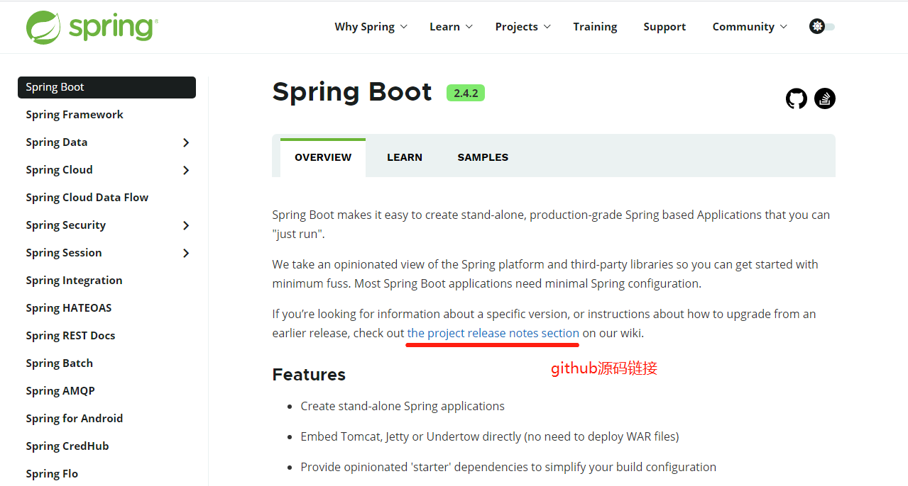
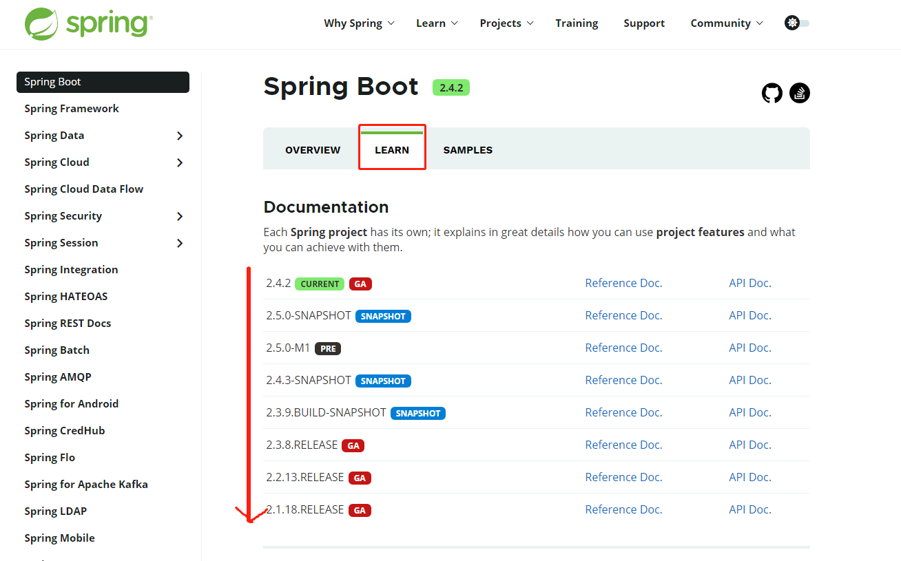
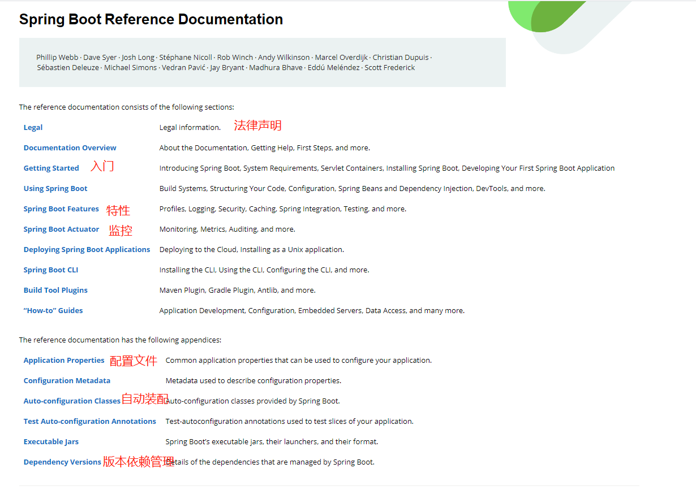
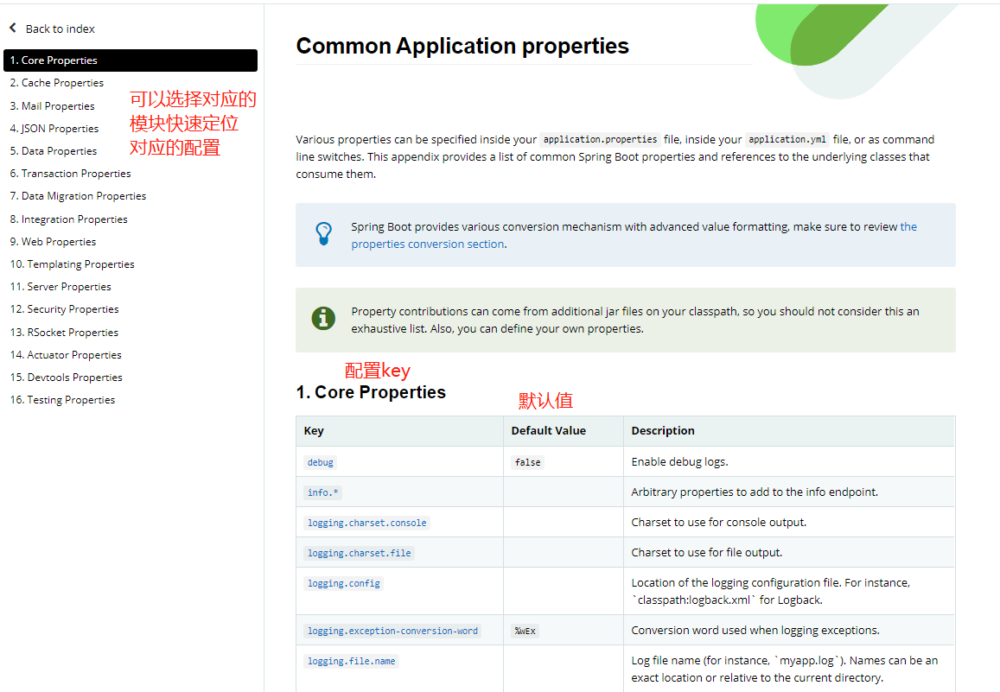

springboot2 相比springboot1 有较大的升级，底层基于java8做了大量优化，所以springboot2开箱要求最低java8 和mava 3.3以上的版本。

可以先了解下springboot1 ，在springboot2中，团队开始主推响应式编程，其原理主要是通过构建异步数据流的方式实现。这里可以提前关注下，后面肯定是将是开发的主流。

Reactor 响应式编程 

在serverless还没有完全兴起之前，响应式编程都是一个大趋势。

在这方面可以先了解下大数据的体系和知识网络。

在springboot的知识体系中，建议先看完尚硅谷的课程，再看马士兵的，老马的教程会讲得比较细。可以作为复习加强。

---

spring -- 配置地狱

springboot -- 简化配置

​	1. starter：自动依赖

	2. 自动配置spring以及第三方功能

---

Spring 官网的查看方式

版本更新，中间位数的可以看github的版本迭代信息，也可以看Reference Doc文档，至于第三位数的版本变更一般可以不看，一般都是写bug修复。

源码位置：

版本文档：

GA是当前稳定版的意思

点解中间的 Reference Doc.可以查看文档的详细信息

点击上图左侧菜单栏中的 Application Properties 可以查看整个springboot 对于各类组件应该怎么配置，springboot2给定的默认值是啥：

