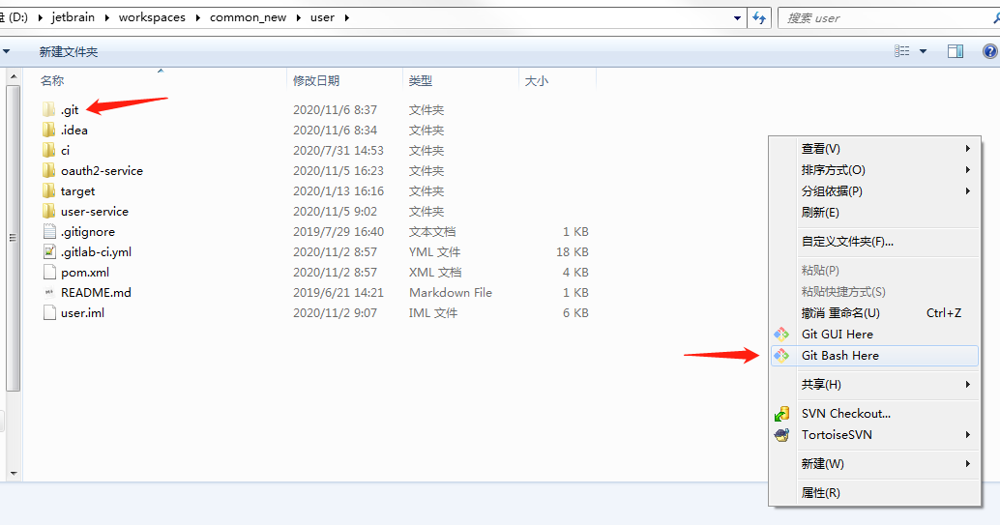
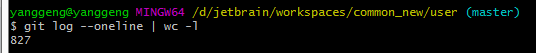
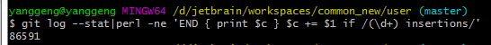
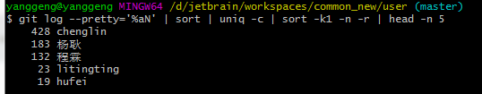
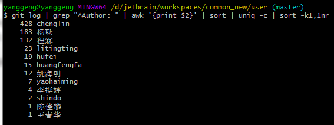
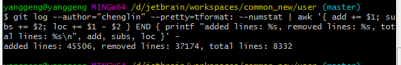
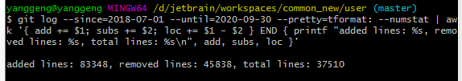
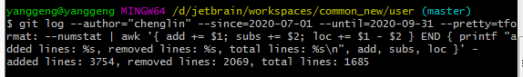

使用命令行统计代码提交记录

进去带.git 目录的文件夹下，打开gitbash窗框



执行以下命令，可进行git数据统计：

### 提交数统计

```shell
git log --oneline | wc -l
```



### 添加或修改的代码行数

```shell
git log --stat|perl -ne 'END { print $c } $c += $1 if /(\d+) insertions/'
```




### 查看仓库提交者排名前5

```shell
git log --pretty='%aN' | sort | uniq -c | sort -k1 -n -r | head -n 5
```



### 查看当前分之所有提交者及提交次数，次数由高到低排序

```shell
git log | grep "^Author: " | awk '{print $2}' | sort | uniq -c | sort -k1,1nr
```



### 根据用户名来统计

```shell

git log --author="chenglin" --pretty=tformat: --numstat | awk '{ add += $1; subs += $2; loc += $1 - $2 } END { printf "added lines: %s, removed lines: %s, total lines: %s\n", add, subs, loc }' -

```




### 根据时间段来统计

```shell
git log --since=2018-07-01 --until=2020-09-30 --pretty=tformat: --numstat | awk '{ add += $1; subs += $2; loc += $1 - $2 } END { printf "added lines: %s, removed lines: %s, total lines: %s\n", add, subs, loc }'

```




### 按用户名/时间段来统计

```shell
git log --author="chenglin" --since=2020-07-01 --until=2020-09-31 --pretty=tformat: --numstat | awk '{ add += $1; subs += $2; loc += $1 - $2 } END { printf "added lines: %s, removed lines: %s, total lines: %s\n", add, subs, loc }' -

```




### git clone 时显示Filename too long的解决办法

在git bash中，运行下列命令： git config --global core.longpaths true

就可以解决该问题。

--global是该参数的使用范围，如果只想对本版本库设置该参数，只要在上述命令中去掉--global即可。


### 强制还原历史节点

git push -f

然后输入用户名/密码 

> 前提：得先把对应分支得branches protected  保护关闭。强制还原后，记得重新配置上保护

该操作很危险，请谨慎操作。


