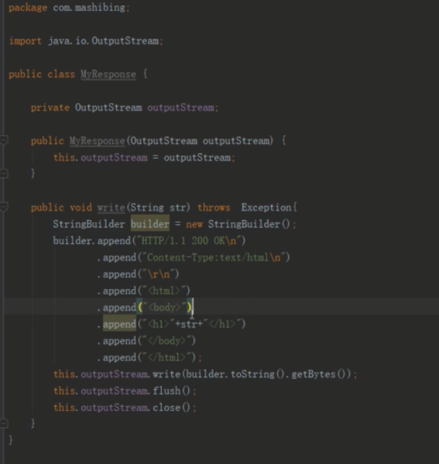

servlet技术产生的背景：动态生成页面

http协议的特点

1、简单快速：定义了数据规范，键值对

2、灵活：content-type ： json  或者  text

3、无连接，http1.1  之前是短链接

4、无状态：不会保存上一次访问的状态

5、支持B/S 和 C/S 架构 ： 浏览器或者客户端都是同样的http协议

http协议请求格式

http响应格式：

http响应状态码：

---

自定义Tomcat架构图：

手写自定义的request对象：

自定义response 对象

自定义mapping

定义抽象servlet接口

servlet子类实现：

自定义MyTomcat服务的启动类：

启动MyTomcat服务

<完>

Tomcat的安装，注意lib目录下的jsp-api.lib 和servlet-api.jar 包，部署项目的时候，区别与传统项目的jar，web项目要打war包，并放在webapps目录下，即可部署成功。

servlet：小服务程序

认识servlet中的request和response，

request和response 对象是由容器封装的。后端服务按需从对象中获取所需参数即可。

