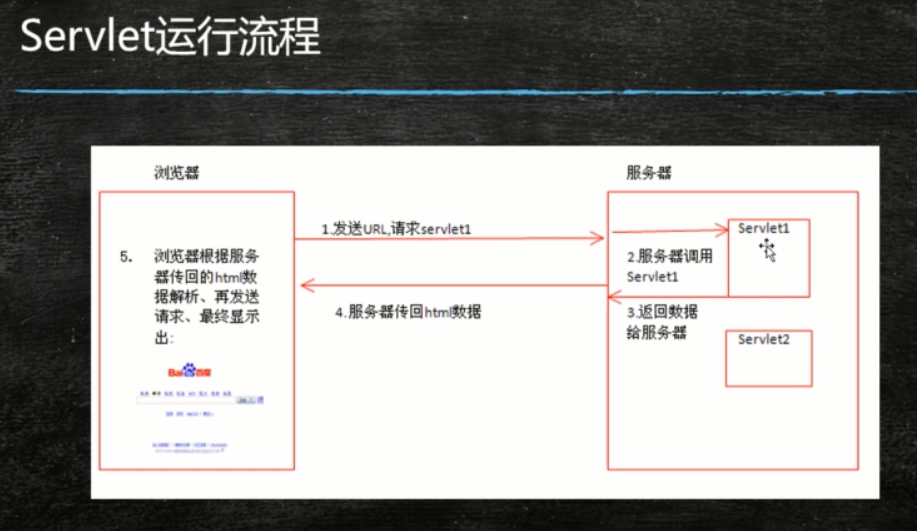

servlet技术产生的背景：动态生成页面

http协议的特点

1、简单快速：定义了数据规范，键值对

2、灵活：content-type ： json  或者  text

3、无连接，http1.1  之前是短链接

4、无状态：不会保存上一次访问的状态

5、支持B/S 和 C/S 架构 ： 浏览器或者客户端都是同样的http协议

http协议请求格式

http响应格式：

http响应状态码：

---

自定义Tomcat架构图：

手写自定义的request对象：

自定义response 对象

自定义mapping

定义抽象servlet接口

servlet子类实现：

自定义MyTomcat服务的启动类：

启动MyTomcat服务

<完>

Tomcat的安装，注意lib目录下的jsp-api.lib 和servlet-api.jar 包，部署项目的时候，区别与传统项目的jar，web项目要打war包，并放在webapps目录下，即可部署成功。

servlet：小服务程序

认识servlet中的request和response，

request和response 对象是由容器封装的。后端服务按需从对象中获取所需参数即可。

request.getDispatcher("page").forword(request, response);

response.sendRediret("hello");

session的技术出现，解决不同请求之间数据共享，但是依赖与cookie

session ： 解决同一个用户的不同请求的数据共享问题

 

servletContext ： 解决不同用户不同请求之间的数据共享问题

---

### JSP

intellij IDEA 中，tomcat编译的文件的存放路径

jsp修改后，不需要重新启动服务就能在页面上看到发生的变化，因为jsp是第一次请求的时候才编译的，但是IDEA中要选中下面两个配置：

设置了pageEncoding之后，其实可以不用设置contentType属性

jsp里面嵌入java代码：

jsp页面的导入方式：

静态或动态导入页面

jsp页面的请求转发

jsp九大内置对象

生成的servlet文件中service方法可以看到这九个内置对象：

四大作用域

路径问题：

EL表达式：

EL表达式的概念：

JSTL的基本介绍和导入

背景:

如果只是EL表示式，要处理较复杂的逻辑的时候，比如if  else 或者for 循环 这些，又需要在jsp页面中写入java代码，这样页面可读性就比较差了。这时就出现了JSTL标签

配置属性

标签学习：菜鸟教程

---

servlet过滤器

场景：设置请求编码集，可以在每个servlet里面设置，但是要重复多次，可以使用同一代码

