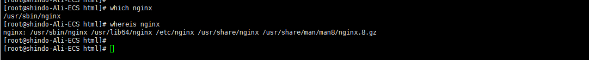
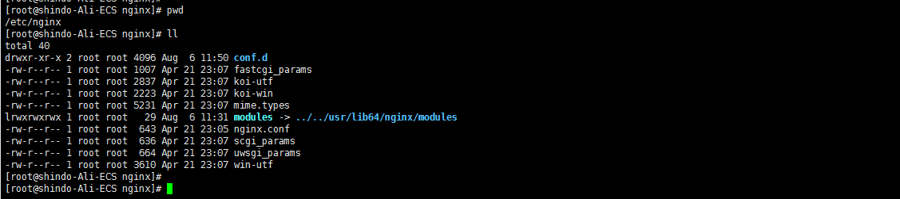
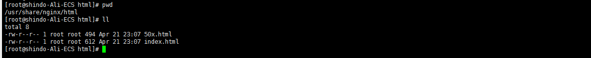

### nginx安装

#### 方式一 yum

```yml
#1、添加Nginx到yum源
sudo rpm -Uvh http://nginx.org/packages/centos/7/noarch/RPMS/nginx-release-centos-7-0.el7.ngx.noarch.rpm
#2、安装Nginx
sudo yum install -y nginx
#3、启动Nginx
sudo systemctl start nginx.service
```

或者简单点，直接使用install命令安装。（不过我是使用以上添加yum源的方式）

```yml
# CentOS
yum install nginx;
# Ubuntu
sudo apt-get install nginx;
# Mac
brew install nginx;
```

可以使用which 或者 whereis 命令搜索 nginx 执行命令所在目录地址



根据以上搜索结果，可发现：

##### nginx默认安装目录  

```yml
/etc/nginx
```



##### 启动脚本

```yml
/usr/sbin/nginx
```

##### 网站文件

```yml
/usr/share/nginx/html
```



##### 自定义配置文件

```yml
/etc/nginx/conf.d/
```

##### 全局配置文件

```
/etc/nginx/nginx.conf
```

#### 启动方式

##### 启动

```
service nginx start
```

或者：

```
systemctl start nginx.service
```

##### 关闭

```yml
service nginx stop
```

##### 重启

热启动，修改配置文件不影响线上

```
nginx -s reload
```

##### 检查配置文件语法

```
nginx -t
```


#### 设置系统开机启动

```yml
systemctl enable nginx.service
```

#### 开放端口

```yml
##Add
firewall-cmd --permanent --zone=public --add-port=80/tcp
##Reload
firewall-cmd --reload
```

注意：如果在阿里云，还要主要配置ecs的安全组策略


#### 访问nginx

##### 查看nginx映射端口

检查/etc/nginx/conf.d/default.conf文件，检查 根目录 /  的映射端口；

默认端口是8080，但是本人服务器部署了apollo，自带的Eureka占用了8080端口，所以这里改为8060。

```yml
server {
    listen       8060;
    server_name  localhost;

    #charset koi8-r;
    #access_log  /var/log/nginx/host.access.log  main;

    location / {
        root   /usr/share/nginx/html;
        index  index.html index.htm;
    }

    #error_page  404              /404.html;

    # redirect server error pages to the static page /50x.html
    #
    error_page   500 502 503 504  /50x.html;
    location = /50x.html {
        root   /usr/share/nginx/html;
    }

    # proxy the PHP scripts to Apache listening on 127.0.0.1:80
    #
    #location ~ \.php$ {
    #    proxy_pass   http://127.0.0.1;
    #}

    # pass the PHP scripts to FastCGI server listening on 127.0.0.1:9000
    #
    #location ~ \.php$ {
    #    root           html;
    #    fastcgi_pass   127.0.0.1:9000;
    #    fastcgi_index  index.php;
    #    fastcgi_param  SCRIPT_FILENAME  /scripts$fastcgi_script_name;
    #    include        fastcgi_params;
    #}

    # deny access to .htaccess files, if Apache's document root
    # concurs with nginx's one
    #
    #location ~ /\.ht {
    #    deny  all;
    #}
}
```

执行 service nginx start 命令启动nginx服务后，即可通过web浏览器访问nginx主页（对应/usr/share/nginx/html/index.html）。


#### 方式二 安装包解压安装

##### 下载nginx安装包

```yml
[root@localhost ~]# wget http://nginx.org/download/nginx-1.10.1.tar.gz
```

##### 复制安装包到你的安装目录

```yml
[root@localhost ~]# cp nginx-1.10.1.tar.gz /usr/local/
```

##### 解压

```yml
[root@localhost ~]# tar -zxvf nginx-1.10.1.tar.gz
[root@localhost ~]# cd nginx-1.10.1
```

##### 启动nginx

```
[root@localhost ~]# /usr/local/nginx/sbin/nginx
```

##### 查看版本

```
[root@localhost ~]# nginx -v
```

##### 访问nginx主页

参考 上面的访问方式

