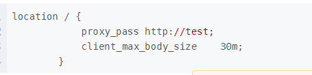

### 请求头大小限制

jetty默认请求头大小8k

nginx默认请求头大小4k

#### 修改方案

1. 修改nginx请求头大小限制

   

> 参考资料：
>
> https://nginx.org/en/docs/http/ngx_http_core_module.html#large_client_header_buffers
> https://www.cnblogs.com/antflow/p/7509680.html
> https://www.cnblogs.com/jpfss/p/10237624.html

2. 修改web容器请求头大小限制

```yaml
改jetty依赖（可以不改）：
        <!--<dependency>
            <groupId>org.springframework.boot</groupId>
            <artifactId>spring-boot-starter-jetty</artifactId>
        </dependency>-->

改yml配置：（需要网关和容器一起改）
server:
  port: 81
  max-http-header-size: 15000
```

如果只是网关放开，容器没放开，也是不行的：


> 注意：如果是springcloud微服务框架，因基于springboot，使用内置的web服务器。需要全链路修改请求头限制。
>
> 参考资料：
>
> https://stackoverflow.com/questions/57889575/how-to-set-max-http-header-size-in-spring-boot-2-x-application
>
> springboot官方资料：https://docs.spring.io/spring-boot/docs/current/reference/html/appendix-application-properties.html
>
> https://github.com/spring-projects/spring-boot/issues/13831

### 请求体大小限制

nginx默认请求体大小：1m

tomcat默认请求体大小：2m

undertow默认对请求体不做限制：


#### 修改方案

1. 修改nginx请求体大小限制



> 参考资料：
>
> https://www.cnblogs.com/baby123/p/13359650.html
> https://blog.csdn.net/weixin_38570967/article/details/82289395

2. 修改web容器请求体大小限制

```yaml
server:
  port: 10080
  max-http-header-size: 15000 # header长度阀值
  tomcat:
    remote_ip_header: x-forwarded-for
    protocol_header: x-forwarded-proto
    port-header: X-Forwarded-Port
    max-http-post-size: 62914560 # 62914560 = 60M
  use-forward-headers: true
  servlet:
    session:
      timeout: 14400 #单位：秒   4小时
  undertow:
    max-http-post-size: 62914560 # 62914560 = 60M
```


#### 这个才有效

```java
  servlet:
    multipart:
      max-request-size: 60MB
      max-file-size: 60MB
```


> 注意：如果是springcloud微服务框架，因基于springboot，使用内置的web服务器。需要全链路修改请求体限制。
>
> 参考资料：https://stackoverflow.com/questions/33232849/increase-http-post-maxpostsize-in-spring-boot
>
> springboot官方文档：https://docs.spring.io/spring-boot/docs/current/reference/html/appendix-application-properties.html
>
> 