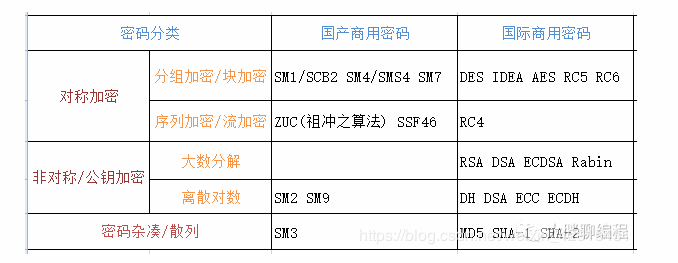
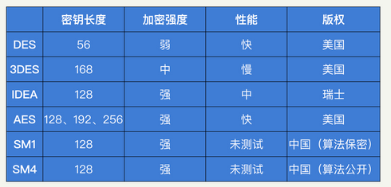
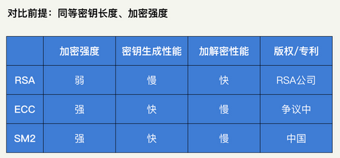
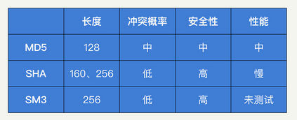

### 对称加密算法

| 算法名 | 完整算法名                                                | 归属及优势                                                   |
| ------ | --------------------------------------------------------- | ------------------------------------------------------------ |
| DES    | 数据加密标准，Data Encryption Standard                    | DES 应该是最早的现代密码学算法之一。它由美国政府提出，密钥长度为 56 位。目前，它暴力破解 56 位密码的时间，已经能控制在 24 小时内了。 |
| IDEA   | 国际数据加密算法，International Data Encryption Algorithm | IDEA 由瑞士研究人员设计，密钥长度为 128 位。对比于其他的密码学算法，IDEA 的优势在于没有专利的限制。相比于 DES 和 AES 的使用受到美国政府的控制，IDEA  的设计人员并没有对其设置太多的限制，这让 IDEA 在全世界范围内得到了广泛地使用和研究。 |
| AES    | 高级加密标准，Advanced  Encryption  Standard              | 在 DES 被破解后，美国政府推出了 AES  算法，提供了 128 位、192 位和 256 位三种密钥长度。通常情况下，我们会使用 128  位的密钥，来获得足够的加密强度，同时保证性能不受影响。目前，AES 是国际上最认可的密码学算法。在算力没有突破性进展的前提下，AES  在可预期的未来都是安全的。 |

#### 对比

在选取加密算法的时候，存在不同的分组计算模式：ECB/CBC/CFB/OFB/CTR。这些模式的具体细节不是我们学习的重点，在这里就不展开了。你需要知道的是：选取 CBC 和 CTR 这两种推荐使用的模式就可以满足大部分需求了，它们在性能和安全性上都有较好的保证。

### 非对称加密算法

| 算法名 | 完整算法名                                | 归属及优势                                                   |
| ------ | ----------------------------------------- | ------------------------------------------------------------ |
| RSA    | RSA 加密算法，RSA Algorithm               | RSA 的数学难题是：两个大质数 p、q 相乘的结果 n 很容易计算，但是根据 n 去做质因数分解得到 p、q，则需要很大的计算量。RSA 是比较经典的非对称加密算法，它的主要优势就是性能比较快，但想获得较高的加密强度，需要使用很长的密钥。 |
| ECC    | 椭圆加密算法，Elliptic Curve Cryptography | ECC 是基于椭圆曲线的一个数学难题设计的。目前学术界普遍认为，椭圆曲线的难度高于大质数难题，160 位密钥的 ECC 加密强度，相当于 1088 位密钥的 RSA。因此，ECC 是目前国际上加密强度最高的非对称加密算法。 |
| SM2    | SM2 Cryptographic Algorithm               | 国密算法 SM2 也是基于椭圆曲线问题设计的，属于国家标准，算法公开，加密强度和国际标准的 ECC 相当。而国密的优势在于国家的支持和认可。 |

#### 对比

### 散列算法

| 算法名 | 完整算法名                               | 归属及优势                                                   |
| ------ | ---------------------------------------- | ------------------------------------------------------------ |
| MD5    | 消息摘要算法，Message-Digest Algorithm 5 | MD5 可以用来生成一个 128  位的消息摘要，它是目前应用比较普遍的散列算法。虽然，因为算法的缺陷，它的唯一性已经被破解了，但是大部分场景下，这并不会构成安全问题。但是，如果不是长度受限（32 个字符），我还是不推荐你继续使用 MD5 的。 |
| SHA    | 安全散列算法，Secure Hash Algorithm      | SHA 是美国开发的政府标准散列算法，分为  SHA-1 和 SHA-2 两个版本，SHA-2 细分的版本我们就不介绍了。和 MD5 相同，虽然 SHA  的唯一性也被破解了，但是这也不会构成大的安全问题。目前，SHA-256 普遍被认为是相对安全的散列算法，也是我最推荐你使用的散列算法。 |
| SM3    | SM3 Cryptographic Algorithm              | 国密算法 SM3 是一种散列算法。其属于国家标准，算法公开，加密强度和国际标准的 SHA-256 相当。和国密 SM2 一样，它的优势也在于国家的支持和认可。 |

#### 对比

我们在使用散列算法的时候，有一点需要注意一下，一定要注意加“盐”。所谓“盐”，就是一串随机的字符，是可以公开的。将用户的密码“盐”进行拼接后，再进行散列计算，这样，即使两个用户设置了相同的密码，也会拥有不同的散列值。同时，黑客往往会提前计算一个彩虹表来提升暴力破解散列值的效率，而我们能够通过加“盐”进行对抗。“盐”值越长，安全性就越高。

### 总结

总的来说，在使用的时候，你要记住下面这些内容：对称加密具备较高的安全性和性能，要优先考虑。在一对多的场景中（如多人登录服务器），存在密钥分发难题的时候，我们要使用非对称加密；不需要可逆计算的时候（如存储密码），我们就使用散列算法。

在具体算法的选取上，你只需要记住：对称加密用 AES-CTR、非对称加密用 ECC、散列算法用 SHA256 加盐。这些算法就能够满足大部分的使用场景了，并且在未来很长一段时间内，都可以保持一个较高的安全强度。