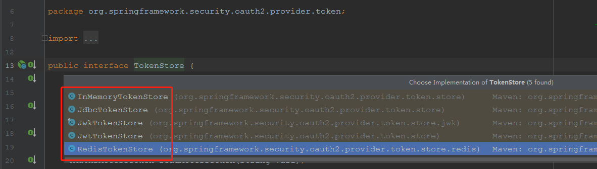
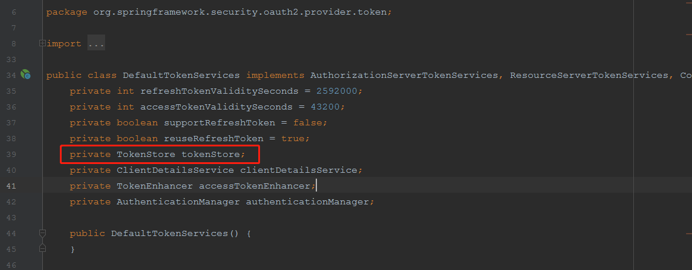
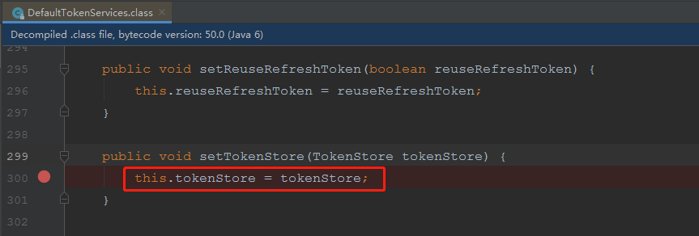

## 原jwtTokenStore方案

### 现有情况

1. oauth授权服务器采用jwtTokenStore，并配合jwtToken转换器加密的方式生成token，token在内存中保存；

2. sso单点登陆网关和资源服务器（各应用端）基于jwtToken转换器解析会话中携带的jwtToken。

### 现有问题

1. 原jwtToken转换器使用对称加密算法对token签名，签名的强度比使用RSA签名弱。
2. jwtToken的结构中保存了用户的权限信息，若用户具备大量权限的情况下，有很大概率超出web容器请求头的初始阀值，导致请求失败。

## 新RedisTokenStore方案

### 概述

改用security-oauth提供的redisTokenStore方式存储token



1. oauth授权服务器采用redisTokenStore存储token，响应给用户accessToken是redis中值对应的key，总体token大小不超1k。

   ```json
   {
       "access_token": "1958d550-a724-48a5-96c1-4a5796e99d5e",
       "token_type": "bearer",
       "refresh_token": "3a5b09de-6b7b-4e2d-8950-62081021425b",
       "expires_in": 2566149,
       "scope": "read",
       "accountSystemKey": "defat",
       "username": "platform_admin"
   }
   ```

2. sso单点登陆网关和资源服务器需替换toke解析方式。

   * sso网关需替换资源解析方式

   ```yaml
   security:
     basic:
       enabled: false
     oauth2:
       client:
         access-token-uri: http://${localhost_ip}:19005/uaa/oauth/token
         user-authorization-uri: http://${localhost_ip}:19005/uaa/oauth/authorize
         client-id: sso-gateway
         client-secret: sso-gateway-secret
       resource:
         #      jwt:
         #        key-value: 123
         user-info-uri: http://${localhost_ip}:19006/user
   ```

   

### 用户改造成本

**<font style='color:yellow'>共两点需改造</font>**

1. 新增redis依赖

   ```xml
   <dependency>
   	<groupId>org.springframework.boot</groupId>
   	<artifactId>spring-boot-starter-data-redis</artifactId>
   </dependency>
   ```

   加入redis连接配置

   ```yaml
   spring:
     redis:
       host: ${localhost}
       port: 16379
       database: 2
       timeout: 10000
   ```

   

2. 替换TokenStore源

```java
//第一步：注入redis连接工厂
@Autowired
RedisConnectionFactory redisConnectionFactory;

//第二步：修改TokenStore源
@Bean
public TokenStore tokenStore() {
    return new RedisTokenStore(redisConnectionFactory);
    //        return new JwtTokenStore(jwtTokenEnhancer());
}
```

### 兼容性

#### 问题

因智厨已对接用户2.0的扫码登陆接口和部分新增的查询接口，要考虑兼容智厨的产品，需考虑：<font style='color:red'>当智厨（或者1.0的服务）请求时，响应的是jwtToken，其他情况响应redisToken。</font>

即可能是这样的效果：

```java
//第二步：修改TokenStore源
@Bean
public TokenStore tokenStore() {
    TokenStore tokenStore = null;
    if("智厨"){
        tokenStore = new JwtTokenStore(jwtTokenEnhancer());
    }else{
        tokenStore = new RedisTokenStore(redisConnectionFactory);
    }
    return tokenStore;
}
```

但TokenStore对象的创建不是动态的。

#### 结论

<font style='color:red'>不支持JwtTokenStore 和 RedisTokenStore 共存。</font>

查看源码，可发现，TokenStore是在创建DefaultTokenService对象时设置的。



