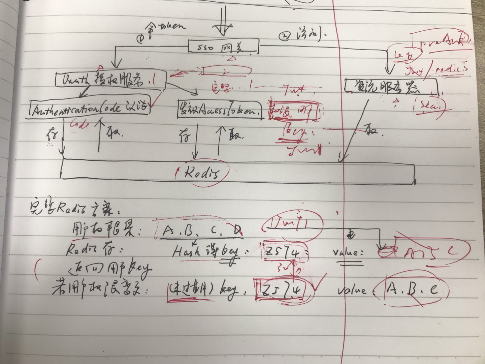
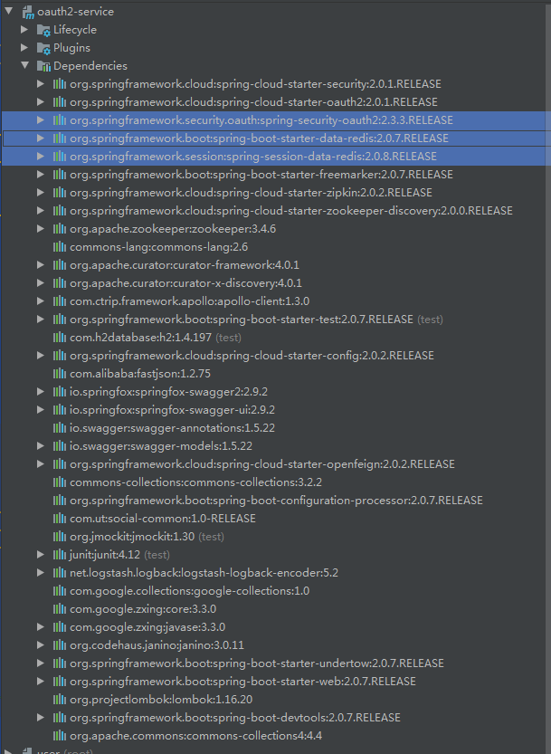
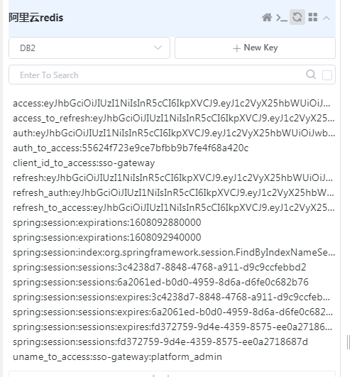

### 为什么要使用springsession

#### 现状

框架原有的方案是使用 zuul + oauth 做单点登录，然后oauth又单独提供密码授权模式。但是oauth服务采用模式的授权端点配置：采用jwtTokenStore并结合jwtAccessTokenConverter()对token增强。增强时使用的HS256的摘要算法。

#### 问题

上述方案的问题：

1、oauth默认的授权服务配置，采用InMemoryAuthorizationCodeServices的方式管理 授权码的校验

2、jwtTokenStore的存储方式，基于HS256摘要，在用户权限特别大的时候，token会超出web容器的请求头长度限制。

3、oauth默认的授权服务配置，session是基于内存管理的。

基于内存，导致oauth授权服务无法实现水平服务伸缩，达到高可用的效果。

### 改造涉及点

1、使用redisTokenStore替换jwtTokenStore，是token缓存在redis中，并很好的利用了redis的过期机制，设置了redis值的过期时间就是oauth客户端配置设置的过期时间

2、使用自定义的redisAuthorizationCodeServices替换框架默认的InMemoryAuthorizationCodeServices服务，使授权码基于redis存储

3、使用redisTokenStore存储后，默认的DefaultTokenServices类中createAccessToken方法的逻辑，会首先从redis中取出旧accessToken，若accessToken未过期，则不重新生成key，只是替换redis缓存中key对应的accessToken的值，然后直接返回。这一点显然是设计者基于性能考虑做了思考，所以并未每次删除旧key，再存一次，而是直接把key对应的值做更新。但是因为我方目前jwttoken的模式已经有业务在用，不能直接切换，所以本次改造只是采用了redisTokenStore存储以便于oauth伸缩，但accessToken仍保留jwtTokenEnhancer的方式做增强响应。这样就会导致如果key不变的情况下，如果用户前一次token未过期，后面即使权限有变动，即值有改动，对于用户来说，token也是没变化的。基于这个情况，我们只能替换DefaultTokenServices，采取每次都生成新的key的方式处理。

详细说明见图：



### 源码：

授权服务器配置 OAuth2Configuration.java

```java
package com.ut.security.oauth2;

import org.springframework.beans.factory.annotation.Autowired;
import org.springframework.beans.factory.annotation.Value;
import org.springframework.context.annotation.Bean;
import org.springframework.context.annotation.Configuration;
import org.springframework.context.annotation.Primary;
import org.springframework.data.redis.connection.RedisConnectionFactory;
import org.springframework.security.authentication.AuthenticationManager;
import org.springframework.security.authentication.AuthenticationProvider;
import org.springframework.security.authentication.ProviderManager;
import org.springframework.security.core.userdetails.UserDetailsByNameServiceWrapper;
import org.springframework.security.core.userdetails.UserDetailsService;
import org.springframework.security.crypto.password.PasswordEncoder;
import org.springframework.security.oauth2.config.annotation.configurers.ClientDetailsServiceConfigurer;
import org.springframework.security.oauth2.config.annotation.web.configuration.AuthorizationServerConfigurerAdapter;
import org.springframework.security.oauth2.config.annotation.web.configurers.AuthorizationServerEndpointsConfigurer;
import org.springframework.security.oauth2.config.annotation.web.configurers.AuthorizationServerSecurityConfigurer;
import org.springframework.security.oauth2.provider.ClientDetailsService;
import org.springframework.security.oauth2.provider.token.TokenEnhancer;
import org.springframework.security.oauth2.provider.token.TokenEnhancerChain;
import org.springframework.security.oauth2.provider.token.TokenStore;
import org.springframework.security.oauth2.provider.token.store.JwtAccessTokenConverter;
import org.springframework.security.oauth2.provider.token.store.redis.RedisTokenStore;
import org.springframework.security.web.authentication.preauth.PreAuthenticatedAuthenticationProvider;
import org.springframework.security.web.authentication.preauth.PreAuthenticatedAuthenticationToken;

import java.util.Arrays;

import static com.ut.security.constants.SecurityConstants.JWT_HS256_KEY;


@Configuration
public class OAuth2Configuration extends AuthorizationServerConfigurerAdapter {
    @Autowired
    private ClientDetailsService clientDetailsService;
    @Autowired
    private UserDetailsService myUserDetailService;
    @Autowired
    private PasswordEncoder passwordEncoder;
    @Autowired
    private RedisConnectionFactory redisConnectionFactory;
    @Autowired
    private RedisAuthorizationCodeServices redisAuthorizationCodeServices;
    @Value("${platform.sso.redirectUri}")
    private String ssoRedirectUri;
    @Value("${spring.oauth2.client.validity_seconds.access_token}")
    private int accessTokenValiditySeconds;
    @Value("${spring.oauth2.client.validity_seconds.refresh_token}")
    private int refreshTokenValiditySeconds;

    /**
     * 客户端配置
     */
    @Override

    public void configure(ClientDetailsServiceConfigurer clients) throws Exception {
        clients.withClientDetails(clientDetailsService);
        clients.inMemory()
                .withClient("sso-gateway")
                .secret(passwordEncoder.encode("sso-gateway-secret"))
                .authorizedGrantTypes("refresh_token", "authorization_code", "password")
                .accessTokenValiditySeconds(accessTokenValiditySeconds)
                .refreshTokenValiditySeconds(refreshTokenValiditySeconds)//30天 单位:秒
                .redirectUris(ssoRedirectUri)
                .scopes("read").autoApprove(true)
                .and()
                .withClient("mobile-client")
                .secret(passwordEncoder.encode("mobile-secret"))
                .authorizedGrantTypes("refresh_token", "authorization_code", "password")
                .accessTokenValiditySeconds(accessTokenValiditySeconds)
                .refreshTokenValiditySeconds(refreshTokenValiditySeconds)
                .scopes("read").autoApprove(true)
                .and()
                .withClient("wulian-client")
                .secret(passwordEncoder.encode("wulian-secret"))
                .authorizedGrantTypes("refresh_token", "authorization_code", "password")
                .accessTokenValiditySeconds(accessTokenValiditySeconds)
                .refreshTokenValiditySeconds(refreshTokenValiditySeconds)
                .scopes("read").autoApprove(true);
    }

    /**
     * tokenKey的访问权限表达式配置
     */
    @Override
    public void configure(AuthorizationServerSecurityConfigurer oauthServer) throws Exception {
        oauthServer.tokenKeyAccess("permitAll()")
                .checkTokenAccess("isAuthenticated()");
    }

    @Autowired
    private AuthenticationManager authenticationManager;
    @Override
    public void configure(AuthorizationServerEndpointsConfigurer endpoints) throws Exception {
        endpoints.tokenStore(tokenStore())
                .tokenServices(tokenServices())
                .authenticationManager(authenticationManager)
                .authorizationCodeServices(redisAuthorizationCodeServices)
                .userDetailsService(myUserDetailService)
                .tokenEnhancer(getTokenEnhancer());
    }

    @Bean
    public TokenStore tokenStore() {
//        return new JwtTokenStore(jwtAccessTokenConverter());
        return new RedisTokenStore(redisConnectionFactory);
    }

    public TokenEnhancer getTokenEnhancer() {
        TokenEnhancerChain tokenEnhancerChain = new TokenEnhancerChain();
        tokenEnhancerChain.setTokenEnhancers(Arrays.asList(customTokenEnhancer(), jwtAccessTokenConverter()));
        return tokenEnhancerChain;
    }

    @Bean
    protected JwtAccessTokenConverter jwtAccessTokenConverter() {
        JwtAccessTokenConverter jwtAccessTokenConverter = new JwtAccessTokenConverter();
        jwtAccessTokenConverter.setSigningKey(JWT_HS256_KEY);
        return jwtAccessTokenConverter;
    }

    @Bean
    public TokenEnhancer customTokenEnhancer() {
        return new CustomTokenEnhancer();
    }

    @Bean
    @Primary
    public CustomTokenServices tokenServices() {
        CustomTokenServices tokenServices = new CustomTokenServices();
        tokenServices.setTokenStore(tokenStore());
        tokenServices.setSupportRefreshToken(true);//支持刷新token
        tokenServices.setReuseRefreshToken(true);
        tokenServices.setClientDetailsService(clientDetailsService);
        tokenServices.setTokenEnhancer(getTokenEnhancer());
        addUserDetailsService(tokenServices, myUserDetailService);
        return tokenServices;
    }

    private void addUserDetailsService(CustomTokenServices tokenServices, UserDetailsService userDetailsService) {
        if (userDetailsService != null) {
            PreAuthenticatedAuthenticationProvider provider = new PreAuthenticatedAuthenticationProvider();
            provider.setPreAuthenticatedUserDetailsService(new UserDetailsByNameServiceWrapper<PreAuthenticatedAuthenticationToken>(
                    userDetailsService));
            tokenServices.setAuthenticationManager(new ProviderManager(Arrays.<AuthenticationProvider>asList(provider)));
        }
    }


}
```

自定义的jwttoken增强器 CustomTokenEnhancer

```java
package com.ut.security.oauth2;

import com.google.common.base.Strings;
import com.ut.security.feign.FeignUserService;
import com.ut.security.feign.MyUserEntity;
import com.ut.security.service.AES_ECB_128_Service;
import org.springframework.beans.factory.annotation.Autowired;
import org.springframework.security.core.userdetails.User;
import org.springframework.security.oauth2.common.DefaultOAuth2AccessToken;
import org.springframework.security.oauth2.common.OAuth2AccessToken;
import org.springframework.security.oauth2.provider.OAuth2Authentication;
import org.springframework.security.oauth2.provider.token.TokenEnhancer;

import java.util.HashMap;
import java.util.Map;

public class CustomTokenEnhancer implements TokenEnhancer {

    @Autowired
    FeignUserService feignUserService;
    @Autowired
    AES_ECB_128_Service aes_ecb_128_service;

    @Override
    public OAuth2AccessToken enhance(OAuth2AccessToken accessToken, OAuth2Authentication authentication) {
        User user = (User) authentication.getPrincipal();
        final Map<String, Object> additionalInfo = new HashMap<>();

//        additionalInfo.put("customInfo", "some_stuff_here");
        // 注意添加的额外信息，最好不要和已有的json对象中的key重名，容易出现错误
        //additionalInfo.put("authorities", user.getAuthorities());
        MyUserEntity userByUid = feignUserService.getUserByUserUid(user.getUsername(), aes_ecb_128_service.getSecurityToken());
        additionalInfo.put("username",userByUid.getUsername());
        additionalInfo.put("accountSystemKey",userByUid.getAccountSystemKey());
        if(!Strings.isNullOrEmpty(userByUid.getParentUser())){
            additionalInfo.put("parentUser", userByUid.getParentUser());
        }

        ((DefaultOAuth2AccessToken) accessToken).setAdditionalInformation(additionalInfo);

        return accessToken;
    }
}


```

自定义的tokenServices：CustomTokenServices，和DefauletTokenServices一样，只是改了createAccessToken的校验逻辑：

```java
package com.ut.security.oauth2;

import org.springframework.beans.factory.InitializingBean;
import org.springframework.security.authentication.AuthenticationManager;
import org.springframework.security.core.Authentication;
import org.springframework.security.core.AuthenticationException;
import org.springframework.security.oauth2.common.*;
import org.springframework.security.oauth2.common.exceptions.InvalidGrantException;
import org.springframework.security.oauth2.common.exceptions.InvalidScopeException;
import org.springframework.security.oauth2.common.exceptions.InvalidTokenException;
import org.springframework.security.oauth2.provider.*;
import org.springframework.security.oauth2.provider.token.*;
import org.springframework.security.web.authentication.preauth.PreAuthenticatedAuthenticationToken;
import org.springframework.transaction.annotation.Transactional;
import org.springframework.util.Assert;

import java.util.Date;
import java.util.Set;
import java.util.UUID;

/**
 * Base implementation for token services using random UUID values for the access token and refresh token values. The
 * main extension point for customizations is the {@link TokenEnhancer} which will be called after the access and
 * refresh tokens have been generated but before they are stored.
 * <p>
 * Persistence is delegated to a {@code TokenStore} implementation and customization of the access token to a
 * {@link TokenEnhancer}.
 *
 * @author Ryan Heaton
 * @author Luke Taylor
 * @author Dave Syer
 */
public class CustomTokenServices implements AuthorizationServerTokenServices, ResourceServerTokenServices,
		ConsumerTokenServices, InitializingBean {

	private int refreshTokenValiditySeconds = 60 * 60 * 24 * 30; // default 30 days.

	private int accessTokenValiditySeconds = 60 * 60 * 12; // default 12 hours.

	private boolean supportRefreshToken = false;

	private boolean reuseRefreshToken = true;

	private TokenStore tokenStore;

	private ClientDetailsService clientDetailsService;

	private TokenEnhancer accessTokenEnhancer;

	private AuthenticationManager authenticationManager;

	/**
	 * Initialize these token services. If no random generator is set, one will be created.
	 */
	public void afterPropertiesSet() throws Exception {
		Assert.notNull(tokenStore, "tokenStore must be set");
	}

	@Transactional
	public OAuth2AccessToken createAccessToken(OAuth2Authentication authentication) throws AuthenticationException {

		OAuth2AccessToken existingAccessToken = tokenStore.getAccessToken(authentication);
		OAuth2RefreshToken refreshToken = null;
		if (existingAccessToken != null) {
			if (existingAccessToken.getRefreshToken() != null) {
				refreshToken = existingAccessToken.getRefreshToken();
				// The token store could remove the refresh token when the
				// access token is removed, but we want to
				// be sure...
				tokenStore.removeRefreshToken(refreshToken);
			}
			//every time get new token
			tokenStore.removeAccessToken(existingAccessToken);
		}

		// Only create a new refresh token if there wasn't an existing one
		// associated with an expired access token.
		// Clients might be holding existing refresh tokens, so we re-use it in
		// the case that the old access token
		// expired.
		if (refreshToken == null) {
			refreshToken = createRefreshToken(authentication);
		}
		// But the refresh token itself might need to be re-issued if it has
		// expired.
		else if (refreshToken instanceof ExpiringOAuth2RefreshToken) {
			ExpiringOAuth2RefreshToken expiring = (ExpiringOAuth2RefreshToken) refreshToken;
			if (System.currentTimeMillis() > expiring.getExpiration().getTime()) {
				refreshToken = createRefreshToken(authentication);
			}
		}

		OAuth2AccessToken accessToken = createAccessToken(authentication, refreshToken);
		tokenStore.storeAccessToken(accessToken, authentication);
		// In case it was modified
		refreshToken = accessToken.getRefreshToken();
		if (refreshToken != null) {
			tokenStore.storeRefreshToken(refreshToken, authentication);
		}
		return accessToken;

	}

	@Transactional(noRollbackFor={InvalidTokenException.class, InvalidGrantException.class})
	public OAuth2AccessToken refreshAccessToken(String refreshTokenValue, TokenRequest tokenRequest)
			throws AuthenticationException {

		if (!supportRefreshToken) {
			throw new InvalidGrantException("Invalid refresh token: " + refreshTokenValue);
		}

		OAuth2RefreshToken refreshToken = tokenStore.readRefreshToken(refreshTokenValue);
		if (refreshToken == null) {
			throw new InvalidGrantException("Invalid refresh token: " + refreshTokenValue);
		}

		OAuth2Authentication authentication = tokenStore.readAuthenticationForRefreshToken(refreshToken);
		if (this.authenticationManager != null && !authentication.isClientOnly()) {
			// The client has already been authenticated, but the user authentication might be old now, so give it a
			// chance to re-authenticate.
			Authentication user = new PreAuthenticatedAuthenticationToken(authentication.getUserAuthentication(), "", authentication.getAuthorities());
			user = authenticationManager.authenticate(user);
			Object details = authentication.getDetails();
			authentication = new OAuth2Authentication(authentication.getOAuth2Request(), user);
			authentication.setDetails(details);
		}
		String clientId = authentication.getOAuth2Request().getClientId();
		if (clientId == null || !clientId.equals(tokenRequest.getClientId())) {
			throw new InvalidGrantException("Wrong client for this refresh token: " + refreshTokenValue);
		}

		// clear out any access tokens already associated with the refresh
		// token.
		tokenStore.removeAccessTokenUsingRefreshToken(refreshToken);

		if (isExpired(refreshToken)) {
			tokenStore.removeRefreshToken(refreshToken);
			throw new InvalidTokenException("Invalid refresh token (expired): " + refreshToken);
		}

		authentication = createRefreshedAuthentication(authentication, tokenRequest);

		if (!reuseRefreshToken) {
			tokenStore.removeRefreshToken(refreshToken);
			refreshToken = createRefreshToken(authentication);
		}

		OAuth2AccessToken accessToken = createAccessToken(authentication, refreshToken);
		tokenStore.storeAccessToken(accessToken, authentication);
		if (!reuseRefreshToken) {
			tokenStore.storeRefreshToken(accessToken.getRefreshToken(), authentication);
		}
		return accessToken;
	}

	public OAuth2AccessToken getAccessToken(OAuth2Authentication authentication) {
		return tokenStore.getAccessToken(authentication);
	}

	/**
	 * Create a refreshed authentication.
	 *
	 * @param authentication The authentication.
	 * @param request The scope for the refreshed token.
	 * @return The refreshed authentication.
	 * @throws InvalidScopeException If the scope requested is invalid or wider than the original scope.
	 */
	private OAuth2Authentication createRefreshedAuthentication(OAuth2Authentication authentication, TokenRequest request) {
		OAuth2Authentication narrowed = authentication;
		Set<String> scope = request.getScope();
		OAuth2Request clientAuth = authentication.getOAuth2Request().refresh(request);
		if (scope != null && !scope.isEmpty()) {
			Set<String> originalScope = clientAuth.getScope();
			if (originalScope == null || !originalScope.containsAll(scope)) {
				throw new InvalidScopeException("Unable to narrow the scope of the client authentication to " + scope
						+ ".", originalScope);
			}
			else {
				clientAuth = clientAuth.narrowScope(scope);
			}
		}
		narrowed = new OAuth2Authentication(clientAuth, authentication.getUserAuthentication());
		return narrowed;
	}

	protected boolean isExpired(OAuth2RefreshToken refreshToken) {
		if (refreshToken instanceof ExpiringOAuth2RefreshToken) {
			ExpiringOAuth2RefreshToken expiringToken = (ExpiringOAuth2RefreshToken) refreshToken;
			return expiringToken.getExpiration() == null
					|| System.currentTimeMillis() > expiringToken.getExpiration().getTime();
		}
		return false;
	}

	public OAuth2AccessToken readAccessToken(String accessToken) {
		return tokenStore.readAccessToken(accessToken);
	}

	public OAuth2Authentication loadAuthentication(String accessTokenValue) throws AuthenticationException,
			InvalidTokenException {
		OAuth2AccessToken accessToken = tokenStore.readAccessToken(accessTokenValue);
		if (accessToken == null) {
			throw new InvalidTokenException("Invalid access token: " + accessTokenValue);
		}
		else if (accessToken.isExpired()) {
			tokenStore.removeAccessToken(accessToken);
			throw new InvalidTokenException("Access token expired: " + accessTokenValue);
		}

		OAuth2Authentication result = tokenStore.readAuthentication(accessToken);
		if (result == null) {
			// in case of race condition
			throw new InvalidTokenException("Invalid access token: " + accessTokenValue);
		}
		if (clientDetailsService != null) {
			String clientId = result.getOAuth2Request().getClientId();
			try {
				clientDetailsService.loadClientByClientId(clientId);
			}
			catch (ClientRegistrationException e) {
				throw new InvalidTokenException("Client not valid: " + clientId, e);
			}
		}
		return result;
	}

	public String getClientId(String tokenValue) {
		OAuth2Authentication authentication = tokenStore.readAuthentication(tokenValue);
		if (authentication == null) {
			throw new InvalidTokenException("Invalid access token: " + tokenValue);
		}
		OAuth2Request clientAuth = authentication.getOAuth2Request();
		if (clientAuth == null) {
			throw new InvalidTokenException("Invalid access token (no client id): " + tokenValue);
		}
		return clientAuth.getClientId();
	}

	public boolean revokeToken(String tokenValue) {
		OAuth2AccessToken accessToken = tokenStore.readAccessToken(tokenValue);
		if (accessToken == null) {
			return false;
		}
		if (accessToken.getRefreshToken() != null) {
			tokenStore.removeRefreshToken(accessToken.getRefreshToken());
		}
		tokenStore.removeAccessToken(accessToken);
		return true;
	}

	private OAuth2RefreshToken createRefreshToken(OAuth2Authentication authentication) {
		if (!isSupportRefreshToken(authentication.getOAuth2Request())) {
			return null;
		}
		int validitySeconds = getRefreshTokenValiditySeconds(authentication.getOAuth2Request());
		String value = UUID.randomUUID().toString();
		if (validitySeconds > 0) {
			return new DefaultExpiringOAuth2RefreshToken(value, new Date(System.currentTimeMillis()
					+ (validitySeconds * 1000L)));
		}
		return new DefaultOAuth2RefreshToken(value);
	}

	private OAuth2AccessToken createAccessToken(OAuth2Authentication authentication, OAuth2RefreshToken refreshToken) {
		DefaultOAuth2AccessToken token = new DefaultOAuth2AccessToken(UUID.randomUUID().toString());
		int validitySeconds = getAccessTokenValiditySeconds(authentication.getOAuth2Request());
		if (validitySeconds > 0) {
			token.setExpiration(new Date(System.currentTimeMillis() + (validitySeconds * 1000L)));
		}
		token.setRefreshToken(refreshToken);
		token.setScope(authentication.getOAuth2Request().getScope());

		return accessTokenEnhancer != null ? accessTokenEnhancer.enhance(token, authentication) : token;
	}

	/**
	 * The access token validity period in seconds
	 *
	 * @param clientAuth the current authorization request
	 * @return the access token validity period in seconds
	 */
	protected int getAccessTokenValiditySeconds(OAuth2Request clientAuth) {
		if (clientDetailsService != null) {
			ClientDetails client = clientDetailsService.loadClientByClientId(clientAuth.getClientId());
			Integer validity = client.getAccessTokenValiditySeconds();
			if (validity != null) {
				return validity;
			}
		}
		return accessTokenValiditySeconds;
	}

	/**
	 * The refresh token validity period in seconds
	 *
	 * @param clientAuth the current authorization request
	 * @return the refresh token validity period in seconds
	 */
	protected int getRefreshTokenValiditySeconds(OAuth2Request clientAuth) {
		if (clientDetailsService != null) {
			ClientDetails client = clientDetailsService.loadClientByClientId(clientAuth.getClientId());
			Integer validity = client.getRefreshTokenValiditySeconds();
			if (validity != null) {
				return validity;
			}
		}
		return refreshTokenValiditySeconds;
	}

	/**
	 * Is a refresh token supported for this client (or the global setting if
	 * {@link #setClientDetailsService(ClientDetailsService) clientDetailsService} is not set.
	 *
	 * @param clientAuth the current authorization request
	 * @return boolean to indicate if refresh token is supported
	 */
	protected boolean isSupportRefreshToken(OAuth2Request clientAuth) {
		if (clientDetailsService != null) {
			ClientDetails client = clientDetailsService.loadClientByClientId(clientAuth.getClientId());
			return client.getAuthorizedGrantTypes().contains("refresh_token");
		}
		return this.supportRefreshToken;
	}

	/**
	 * An access token enhancer that will be applied to a new token before it is saved in the token store.
	 *
	 * @param accessTokenEnhancer the access token enhancer to set
	 */
	public void setTokenEnhancer(TokenEnhancer accessTokenEnhancer) {
		this.accessTokenEnhancer = accessTokenEnhancer;
	}

	/**
	 * The validity (in seconds) of the refresh token. If less than or equal to zero then the tokens will be
	 * non-expiring.
	 *
	 * @param refreshTokenValiditySeconds The validity (in seconds) of the refresh token.
	 */
	public void setRefreshTokenValiditySeconds(int refreshTokenValiditySeconds) {
		this.refreshTokenValiditySeconds = refreshTokenValiditySeconds;
	}

	/**
	 * The default validity (in seconds) of the access token. Zero or negative for non-expiring tokens. If a client
	 * details service is set the validity period will be read from the client, defaulting to this value if not defined
	 * by the client.
	 *
	 * @param accessTokenValiditySeconds The validity (in seconds) of the access token.
	 */
	public void setAccessTokenValiditySeconds(int accessTokenValiditySeconds) {
		this.accessTokenValiditySeconds = accessTokenValiditySeconds;
	}

	/**
	 * Whether to support the refresh token.
	 *
	 * @param supportRefreshToken Whether to support the refresh token.
	 */
	public void setSupportRefreshToken(boolean supportRefreshToken) {
		this.supportRefreshToken = supportRefreshToken;
	}

	/**
	 * Whether to reuse refresh tokens (until expired).
	 *
	 * @param reuseRefreshToken Whether to reuse refresh tokens (until expired).
	 */
	public void setReuseRefreshToken(boolean reuseRefreshToken) {
		this.reuseRefreshToken = reuseRefreshToken;
	}

	/**
	 * The persistence strategy for token storage.
	 *
	 * @param tokenStore the store for access and refresh tokens.
	 */
	public void setTokenStore(TokenStore tokenStore) {
		this.tokenStore = tokenStore;
	}

	/**
	 * An authentication manager that will be used (if provided) to check the user authentication when a token is
	 * refreshed.
	 *
	 * @param authenticationManager the authenticationManager to set
	 */
	public void setAuthenticationManager(AuthenticationManager authenticationManager) {
		this.authenticationManager = authenticationManager;
	}

	/**
	 * The client details service to use for looking up clients (if necessary). Optional if the access token expiry is
	 * set globally via {@link #setAccessTokenValiditySeconds(int)}.
	 *
	 * @param clientDetailsService the client details service
	 */
	public void setClientDetailsService(ClientDetailsService clientDetailsService) {
		this.clientDetailsService = clientDetailsService;
	}

}
```

自定义的AuhenticationCodeService：RedisAuthorizationCodeServices.java

```java
package com.ut.security.oauth2;

import lombok.extern.slf4j.Slf4j;
import org.springframework.beans.factory.annotation.Autowired;
import org.springframework.dao.DataAccessException;
import org.springframework.data.redis.connection.RedisConnection;
import org.springframework.data.redis.connection.RedisStringCommands;
import org.springframework.data.redis.core.RedisCallback;
import org.springframework.data.redis.core.RedisTemplate;
import org.springframework.data.redis.core.types.Expiration;
import org.springframework.security.oauth2.common.util.SerializationUtils;
import org.springframework.security.oauth2.provider.OAuth2Authentication;
import org.springframework.security.oauth2.provider.code.RandomValueAuthorizationCodeServices;
import org.springframework.stereotype.Service;

import java.util.concurrent.TimeUnit;

@Service
@Slf4j
public class RedisAuthorizationCodeServices extends RandomValueAuthorizationCodeServices {
	@Autowired
	private RedisTemplate<Object, Object> redisTemplate;

	/**
	 * 存储code到redis，并设置过期时间，10分钟<br>
	 * value为OAuth2Authentication序列化后的字节<br>
	 * 因为OAuth2Authentication没有无参构造函数<br>
	 * redisTemplate.opsForValue().set(key, value, timeout, unit);
	 * 这种方式直接存储的话，redisTemplate.opsForValue().get(key)的时候有些问题，
	 * 所以这里采用最底层的方式存储，get的时候也用最底层的方式获取
	 */
	@Override
	protected void store(String code, OAuth2Authentication authentication) {
		log.info("==> redis store code :" + code + ", username = " + authentication.getName());
		redisTemplate.execute(new RedisCallback<Long>() {
			@Override
			public Long doInRedis(RedisConnection connection) throws DataAccessException {
				connection.set(codeKey(code).getBytes(), SerializationUtils.serialize(authentication),
						Expiration.from(10, TimeUnit.MINUTES), RedisStringCommands.SetOption.UPSERT);
				return 1L;
			}
		});
	}

	@Override
	protected OAuth2Authentication remove(final String code) {
		log.info("==> redis remove code :" + code);
		OAuth2Authentication oAuth2Authentication = redisTemplate.execute(new RedisCallback<OAuth2Authentication>() {
			@Override
			public OAuth2Authentication doInRedis(RedisConnection connection) throws DataAccessException {
				byte[] keyByte = codeKey(code).getBytes();
				byte[] valueByte = connection.get(keyByte);

				if (valueByte != null) {
					connection.del(keyByte);
					return SerializationUtils.deserialize(valueByte);
				}

				return null;
			}
		});

		return oAuth2Authentication;
	}

	/**
	 * 拼装redis中key的前缀
	 *
	 * @param code
	 * @return
	 */
	private String codeKey(String code) {
		return "oauth2:codes:" + code;
	}
}


```

### 客户端授权

因为客户端授权是单独在successHandler里面做了处理，不经过TokenEnpoint的流程，所以需要手动同步改造：

AppAuthenticationSuccessHandler.java

```java
package com.ut.security.filter.client.authentication;

import com.fasterxml.jackson.databind.ObjectMapper;
import com.ut.security.oauth2.CustomTokenServices;
import com.ut.security.service.LoginCheckService;
import com.ut.security.service.OAuth2Service;
import com.ut.security.utils.RequestUtils;
import lombok.extern.slf4j.Slf4j;
import org.springframework.beans.factory.annotation.Autowired;
import org.springframework.core.annotation.Order;
import org.springframework.security.core.Authentication;
import org.springframework.security.oauth2.common.OAuth2AccessToken;
import org.springframework.security.oauth2.common.exceptions.UnapprovedClientAuthenticationException;
import org.springframework.security.oauth2.provider.ClientDetails;
import org.springframework.security.oauth2.provider.OAuth2Authentication;
import org.springframework.security.oauth2.provider.OAuth2Request;
import org.springframework.security.oauth2.provider.TokenRequest;
import org.springframework.security.web.authentication.SavedRequestAwareAuthenticationSuccessHandler;
import org.springframework.stereotype.Component;

import javax.servlet.ServletException;
import javax.servlet.http.HttpServletRequest;
import javax.servlet.http.HttpServletResponse;
import java.io.IOException;
import java.util.Map;

/**
 * APP环境下认证成功处理器
 */
@Component("appAuthenticationSuccessHandler")
@Order(Integer.MIN_VALUE)
@Slf4j
public class AppAuthenticationSuccessHandler extends SavedRequestAwareAuthenticationSuccessHandler {

	@Autowired
	private ObjectMapper objectMapper;
	@Autowired
	private OAuth2Service oAuth2Service;

	@Autowired
	private CustomTokenServices customTokenServices;

	@SuppressWarnings("unchecked")
	@Override
	public void onAuthenticationSuccess(HttpServletRequest request, HttpServletResponse response,
	                                    Authentication authentication) throws IOException, ServletException {

		log.info(LoginCheckService.getLoginInfo(request, null));
		response.setContentType("application/json;charset=UTF-8");

		String header = request.getHeader("Authorization");

		if (header == null || !header.startsWith("Basic ")) {
			throw new UnapprovedClientAuthenticationException("请求头中无client信息");
		}

		String[] tokens = oAuth2Service.extractAndDecodeHeader(header, response);
		assert tokens.length == 2;

		String clientId = tokens[0];
		String clientSecret = tokens[1];

		//校验client_id 和 client_secret
		ClientDetails clientDetails = oAuth2Service.getClientDetails(response, clientId, clientSecret);
		Map requestParamMap = RequestUtils.getRequestParamMap(request);
		String grantType = (String) requestParamMap.get("grant_type");

		TokenRequest tokenRequest = new TokenRequest(requestParamMap, clientId, clientDetails.getScope(), grantType);

		OAuth2Request oAuth2Request = tokenRequest.createOAuth2Request(clientDetails);

		OAuth2Authentication oAuth2Authentication = new OAuth2Authentication(oAuth2Request, authentication);

		/*
		AuthorizationServerTokenServices authorizationServerTokenServices = SpringUtils.getBean(AuthorizationServerTokenServices.class);
		OAuth2AccessToken token = authorizationServerTokenServices.createAccessToken(oAuth2Authentication);*/

		OAuth2AccessToken token = customTokenServices.createAccessToken(oAuth2Authentication);

		response.setContentType("application/json;charset=UTF-8");
		response.getWriter().write(objectMapper.writeValueAsString(token));
	}

}

```

配合的Oauth2Service.java

```java
package com.ut.security.service;

import com.fasterxml.jackson.databind.ObjectMapper;
import com.ut.security.VO.UtFailureResponseVO;
import com.ut.security.utils.SpringUtils;
import org.springframework.beans.factory.annotation.Autowired;
import org.springframework.security.crypto.codec.Base64;
import org.springframework.security.crypto.password.PasswordEncoder;
import org.springframework.security.oauth2.common.exceptions.InvalidScopeException;
import org.springframework.security.oauth2.provider.ClientDetails;
import org.springframework.security.oauth2.provider.ClientDetailsService;
import org.springframework.security.oauth2.provider.NoSuchClientException;
import org.springframework.stereotype.Component;

import javax.servlet.http.HttpServletResponse;
import java.io.IOException;
import java.util.Iterator;
import java.util.Set;

@Component
public class OAuth2Service {
	@Autowired
	private ObjectMapper objectMapper;
	@Autowired
	private ClientDetailsService clientDetailsService;

	/**
	 * 解析请求头，获取client_id、client_secret
	 */
	public String[] extractAndDecodeHeader(String header, HttpServletResponse response) throws IOException {

		byte[] base64Token = header.substring(6).getBytes("UTF-8");
		byte[] decoded;
		try {
			decoded = Base64.decode(base64Token);
		} catch (IllegalArgumentException e) {
			response.getWriter().write(objectMapper.writeValueAsString(new UtFailureResponseVO("解析请求头 authentication 异常！")));//Failed to decode basic authentication token
			return null;
		}

		String token = new String(decoded, "UTF-8");

		int delim = token.indexOf(":");

		if (delim == -1) {
			response.getWriter().write(objectMapper.writeValueAsString(new UtFailureResponseVO("请求头 authentication 格式不符合要求")));//Invalid basic authentication token
			return null;
		}
		return new String[]{token.substring(0, delim), token.substring(delim + 1)};
	}

	/**
	 * 获取clientDetails，并校验client_id和client_secret
	 */
	public ClientDetails getClientDetails(HttpServletResponse response, String clientId, String clientSecret) throws IOException {
		ClientDetails clientDetails;
		try {
			clientDetails = clientDetailsService.loadClientByClientId(clientId);
		} catch (NoSuchClientException e) {
			response.getWriter().write(objectMapper.writeValueAsString(new UtFailureResponseVO("clientId对应的配置信息不存在:" + clientId)));
			return null;
		}
		PasswordEncoder passwordEncoder = SpringUtils.getBean(PasswordEncoder.class);
		if (!passwordEncoder.matches(clientSecret, clientDetails.getClientSecret())) {
			response.getWriter().write(objectMapper.writeValueAsString(new UtFailureResponseVO("clientSecret不匹配:" + clientSecret)));
			return null;
		}
		return clientDetails;
	}

	/**
	 * 校验scope
	 */
	private void validateScope(HttpServletResponse response, Set<String> requestScopes, Set<String> clientScopes) {
		if (clientScopes != null && !clientScopes.isEmpty()) {
			Iterator var3 = requestScopes.iterator();

			while (var3.hasNext()) {
				String scope = (String) var3.next();
				if (!clientScopes.contains(scope)) {
					throw new InvalidScopeException("Invalid scope: " + scope, clientScopes);
				}
			}
		}

		if (requestScopes.isEmpty()) {
			throw new InvalidScopeException("Empty scope (either the client or the sms is not allowed the requested scopes)");
		}
	}

	/*public static void main(String[] args) {
		String clientAndSecret = "sso-gateway:sso-gateway-secret";
		clientAndSecret = "Basic "+ java.util.Base64.getEncoder().encodeToString(clientAndSecret.getBytes());
		System.out.println("clientAndSecret:" + clientAndSecret);
	}*/
}

```

本次改造对应的包依赖版本：




```xml
<?xml version="1.0" encoding="UTF-8"?>
<project xmlns="http://maven.apache.org/POM/4.0.0"
		 xmlns:xsi="http://www.w3.org/2001/XMLSchema-instance"
		 xsi:schemaLocation="http://maven.apache.org/POM/4.0.0 http://maven.apache.org/xsd/maven-4.0.0.xsd">
	<modelVersion>4.0.0</modelVersion>
	<groupId>com.ut</groupId>
	<artifactId>oauth2-service</artifactId>
	<version>2.0.7-SNAPSHOT</version>

	<parent>
		<groupId>com.ut</groupId>
		<artifactId>user</artifactId>
		<version>0.0.1-SNAPSHOT</version>
	</parent>

	<properties>
		<!-- 仓库地址 -->
		<registryUrl>reg.utcook.com</registryUrl>
		<!--注意仓库名 -->
		<registryProject>pub</registryProject>
		<!-- docker iamge名 -->
		<dockerImageName>${project.artifactId}</dockerImageName>
		<!-- docker iamge tag -->
		<dockerImageTag>${project.version}</dockerImageTag>
		<!-- docker image 完整url -->
		<dockerImageUrl>${registryUrl}/${registryProject}/${dockerImageName}:${dockerImageTag}</dockerImageUrl>
		<project.build.sourceEncoding>UTF-8</project.build.sourceEncoding>
		<java.version>1.8</java.version>
		<maven.compiler.source>1.8</maven.compiler.source>
		<maven.compiler.target>1.8</maven.compiler.target>
	</properties>

	<dependencies>
		<dependency>
			<groupId>org.springframework.cloud</groupId>
			<artifactId>spring-cloud-starter-security</artifactId>
		</dependency>
		<dependency>
			<groupId>org.springframework.cloud</groupId>
			<artifactId>spring-cloud-starter-oauth2</artifactId>
		</dependency>
		<!--解决spring-data-redis 2.0版本 set(String,String)方法被弃用的问题：
		java.lang.NoSuchMethodError: org.springframework.data.redis.connection.RedisConnection.set([B[B)V -->
		<dependency>
			<groupId>org.springframework.security.oauth</groupId>
			<artifactId>spring-security-oauth2</artifactId>
			<version>2.3.3.RELEASE</version>
		</dependency>
		<!--redis-->
		<dependency>
			<groupId>org.springframework.boot</groupId>
			<artifactId>spring-boot-starter-data-redis</artifactId>
		</dependency>
		<!--实现对 Spring Session 使用redis作为数据源的自动化配置-->
		<dependency>
			<groupId>org.springframework.session</groupId>
			<artifactId>spring-session-data-redis</artifactId>
		</dependency>
		<dependency>
			<groupId>org.springframework.boot</groupId>
			<artifactId>spring-boot-starter-freemarker</artifactId>
		</dependency>
		<dependency>
			<groupId>org.springframework.cloud</groupId>
			<artifactId>spring-cloud-starter-zipkin</artifactId>
		</dependency>
		<dependency>
			<groupId>org.springframework.cloud</groupId>
			<artifactId>spring-cloud-starter-zookeeper-discovery</artifactId>
		</dependency>
		<dependency>
			<groupId>org.apache.zookeeper</groupId>
			<artifactId>zookeeper</artifactId>
			<version>3.4.6</version>
			<exclusions>
				<exclusion>
					<groupId>org.slf4j</groupId>
					<artifactId>slf4j-log4j12</artifactId>
				</exclusion>
				<exclusion>
					<groupId>log4j</groupId>
					<artifactId>log4j</artifactId>
				</exclusion>
			</exclusions>
		</dependency>
		<dependency>
			<groupId>commons-lang</groupId>
			<artifactId>commons-lang</artifactId>
			<version>2.6</version>
		</dependency>
		<dependency>
			<groupId>org.apache.curator</groupId>
			<artifactId>curator-framework</artifactId>
			<version>4.0.1</version>
		</dependency>
		<dependency>
			<groupId>org.apache.curator</groupId>
			<artifactId>curator-x-discovery</artifactId>
			<version>4.0.1</version>
		</dependency>
		<dependency>
			<groupId>com.ctrip.framework.apollo</groupId>
			<artifactId>apollo-client</artifactId>
			<version>1.3.0</version>
		</dependency>
		<dependency>
			<groupId>org.springframework.boot</groupId>
			<artifactId>spring-boot-starter-test</artifactId>
			<scope>test</scope>
		</dependency>
		<dependency>
			<groupId>com.h2database</groupId>
			<artifactId>h2</artifactId>
			<scope>test</scope>
		</dependency>
		<dependency>
			<groupId>org.springframework.cloud</groupId>
			<artifactId>spring-cloud-starter-config</artifactId>
		</dependency>
		<dependency>
			<groupId>com.alibaba</groupId>
			<artifactId>fastjson</artifactId>
			<version>1.2.75</version>
		</dependency>
		<dependency>
			<groupId>io.springfox</groupId>
			<artifactId>springfox-swagger2</artifactId>
			<scope>compile</scope>
			<version>2.9.2</version>
		</dependency>
		<dependency>
			<groupId>io.springfox</groupId>
			<artifactId>springfox-swagger-ui</artifactId>
			<scope>compile</scope>
			<version>2.9.2</version>
		</dependency>
		<!--解决swagger2.9.2版本转换Long类型报错的问题-->
		<dependency>
			<groupId>io.swagger</groupId>
			<artifactId>swagger-annotations</artifactId>
			<version>1.5.22</version>
		</dependency>
		<dependency>
			<groupId>io.swagger</groupId>
			<artifactId>swagger-models</artifactId>
			<version>1.5.22</version>
		</dependency>
		<dependency>
			<groupId>org.springframework.cloud</groupId>
			<artifactId>spring-cloud-starter-openfeign</artifactId>
		</dependency>
		<dependency>
			<groupId>commons-collections</groupId>
			<artifactId>commons-collections</artifactId>
			<version>3.2.2</version>
		</dependency>
		<dependency>
			<groupId>org.springframework.boot</groupId>
			<artifactId>spring-boot-configuration-processor</artifactId>
			<optional>true</optional>
		</dependency>
		<!--第三方授权登录的工具包-->
		<dependency>
			<groupId>com.ut</groupId>
			<artifactId>social-common</artifactId>
			<version>1.0-RELEASE</version>
		</dependency>
		<dependency>
			<groupId>org.jmockit</groupId>
			<artifactId>jmockit</artifactId>
			<version>1.30</version>
			<scope>test</scope>
		</dependency>
		<dependency>
			<groupId>junit</groupId>
			<artifactId>junit</artifactId>
			<version>4.12</version>
			<scope>test</scope>
		</dependency>
		<dependency>
			<groupId>net.logstash.logback</groupId>
			<artifactId>logstash-logback-encoder</artifactId>
			<version>5.2</version>
		</dependency>
		<dependency>
			<groupId>com.google.collections</groupId>
			<artifactId>google-collections</artifactId>
			<version>1.0</version>
		</dependency>
		<!--生成二维码-->
		<dependency>
			<groupId>com.google.zxing</groupId>
			<artifactId>core</artifactId>
			<version>3.3.0</version>
		</dependency>
		<dependency>
			<groupId>com.google.zxing</groupId>
			<artifactId>javase</artifactId>
			<version>3.3.0</version>
		</dependency>
		<!-- logback -->
		<dependency>
			<groupId>net.logstash.logback</groupId>
			<artifactId>logstash-logback-encoder</artifactId>
			<version>5.2</version>
		</dependency>
		<dependency>
			<groupId>org.codehaus.janino</groupId>
			<artifactId>janino</artifactId>
		</dependency>
	</dependencies>

	<build>
		<plugins>
			<plugin>
				<groupId>com.spotify</groupId>
				<artifactId>docker-maven-plugin</artifactId>
				<version>1.0.0</version>
				<configuration>
					<dockerHost>http://192.168.105.71:2375</dockerHost>
					<serverId>dockerId</serverId>
					<imageName>${dockerImageUrl}</imageName>
					<baseImage>openjdk:8-jdk-alpine</baseImage>
					<entryPoint>["java", "-Xdebug", "-Xnoagent", "-Djava.compiler=NONE", "-Xrunjdwp:transport=dt_socket,address=5005,server=y,suspend=n","-Duser.timezone=GMT+08","-Djava.security.egd=file:/dev/./urandom", "-jar", "/${project.build.finalName}.jar"]</entryPoint>
					<resources>
						<resource>
							<targetPath>/</targetPath>
							<directory>${project.build.directory}</directory>
							<include>${project.build.finalName}.jar</include>
						</resource>
					</resources>
				</configuration>
				<executions>
					<execution>
						<phase>install</phase>
						<goals>
							<goal>build</goal>
						</goals>
					</execution>
					<execution>
						<id>tag-image</id>
						<phase>install</phase>
						<goals>
							<goal>tag</goal>
						</goals>
						<configuration>
							<image>${dockerImageUrl}</image>
							<newName>
								${dockerImageUrl}
							</newName>
						</configuration>
					</execution>
					<execution>
						<id>push-image</id>
						<phase>install</phase>
						<goals>
							<goal>push</goal>
						</goals>
						<configuration>
							<imageName>
								${dockerImageUrl}
							</imageName>
						</configuration>
					</execution>
				</executions>
			</plugin>
		</plugins>
	</build>

</project>

```

父pom

```xml
<?xml version="1.0" encoding="UTF-8"?>
<project xmlns="http://maven.apache.org/POM/4.0.0" xmlns:xsi="http://www.w3.org/2001/XMLSchema-instance"
	xsi:schemaLocation="http://maven.apache.org/POM/4.0.0 http://maven.apache.org/xsd/maven-4.0.0.xsd">
	<modelVersion>4.0.0</modelVersion>
	<groupId>com.ut</groupId>
	<artifactId>user</artifactId>
	<version>0.0.1-SNAPSHOT</version>
	<packaging>pom</packaging>

	<modules>
		<module>oauth2-service</module>
		<module>user-service</module>
	</modules>

	<parent>
		<groupId>org.springframework.boot</groupId>
		<artifactId>spring-boot-starter-parent</artifactId>
		<version>2.0.7.RELEASE</version>
	</parent>

	<properties>
		<project.build.sourceEncoding>UTF-8</project.build.sourceEncoding>
		<java.version>1.8</java.version>
		<maven.compiler.source>1.8</maven.compiler.source>
		<maven.compiler.target>1.8</maven.compiler.target>
	</properties>

	<dependencies>
		<dependency>
			<groupId>org.springframework.boot</groupId>
			<artifactId>spring-boot-starter-undertow</artifactId>
		</dependency>
		<dependency>
			<groupId>org.springframework.boot</groupId>
			<artifactId>spring-boot-starter-web</artifactId>
			<exclusions>
				<exclusion>
					<groupId>org.springframework.boot</groupId>
					<artifactId>spring-boot-starter-tomcat</artifactId>
				</exclusion>
			</exclusions>
		</dependency>
		<dependency>
			<groupId>org.projectlombok</groupId>
			<artifactId>lombok</artifactId>
			<version>1.16.20</version>
		</dependency>
		<dependency>
			<groupId>org.springframework.boot</groupId>
			<artifactId>spring-boot-devtools</artifactId>
		</dependency>
		<dependency>
			<groupId>org.apache.commons</groupId>
			<artifactId>commons-collections4</artifactId>
			<version>4.4</version>
		</dependency>
	</dependencies>

	<dependencyManagement>
		<dependencies>
			<dependency>
				<groupId>org.springframework.cloud</groupId>
				<artifactId>spring-cloud-dependencies</artifactId>
				<version>Finchley.SR2</version>
				<type>pom</type>
				<scope>import</scope>
			</dependency>
		</dependencies>
	</dependencyManagement>

	<build>
		<plugins>
			<plugin>
				<groupId>org.springframework.boot</groupId>
				<artifactId>spring-boot-maven-plugin</artifactId>
				<configuration>
					<fork>true</fork><!-- 如果没有该项配置，devtools不会起作用，即应用不会restart -->
				</configuration>
			</plugin>
		</plugins>
	</build>

	<repositories>
		<repository>
			<id>nexus</id>
			<name>Nexus Repository</name>
			<url>https://nexus.utcook.com/repository/maven-public/</url>
			<releases>
				<enabled>true</enabled>
			</releases>
			<!--snapshots默认是关闭的,需要开启  -->
			<snapshots>
				<enabled>false</enabled>
			</snapshots>
		</repository>
	</repositories>

	<pluginRepositories>
		<pluginRepository>
			<id>central</id>
			<name>CentralRepository</name>
			<url>https://nexus.utcook.com/repository/maven-public/</url>
			<layout>default</layout>
			<snapshots>
				<enabled>false</enabled>
			</snapshots>
			<releases>
				<updatePolicy>never</updatePolicy>
			</releases>
		</pluginRepository>
	</pluginRepositories>

</project>

```


spring session 改造方案

redis存储session的单个用户的完整信息：




利用了的redis的过期机制，把数据做过期时间管理

压测性能对比：

最原始的版本---> 改用springsession后的单节点版本--->开启双节点后