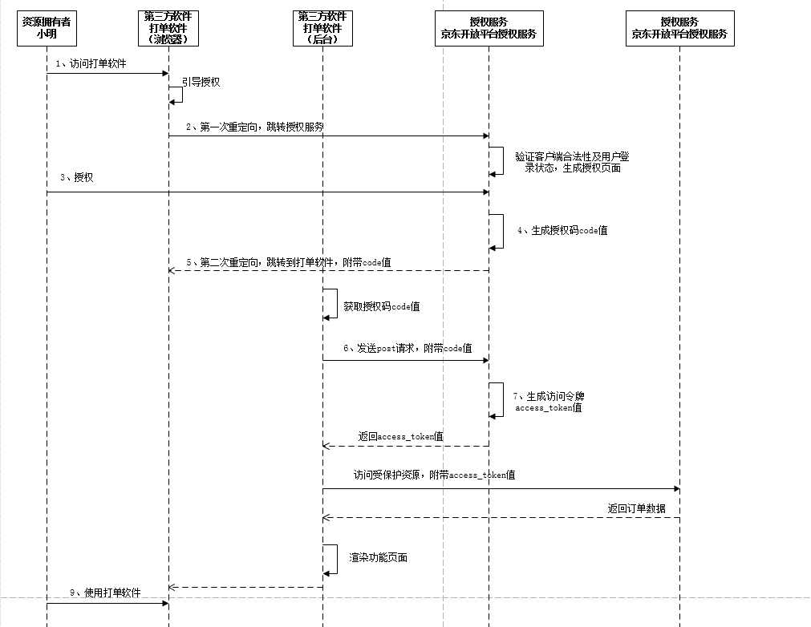

这个世界上什么最贵？

1、oauth和security属于哪个技术层面的事情，为什么会出现这个俩哥们

课题太大，能讲多少讲多少。

讲security 不讲oauth，就有点耍流氓了。

oauth，现在大家看到的都是oauth2 ，为什么叫2，因为她真的有两套，我们这里主要讲oauth2，想了解oauth1的，出门右拐。

oauth1和oauth2的最大区别，就是流程的改进，变得更全面，更安全，当然也更啰嗦。这个我们后面讲oauth2的授权模式的就能体会了。

至于spring security是什么？

​	1、来自大佬，功能强大，spring 默认组件

​	2、开箱即用，在项目里面，你只是加一个security依赖，就给你实现一套完整的安全拦截。

1、会话管理的前世今生--引出token及跨域

cookie、session、token

同源策略与跨域 ，csrf攻击

单点登陆：CAS、oauth、openID

jwt

sso引出oauth和openId

结论：一切为了安全

2、讲oauth的理论模型-参考极客时间，王新栋老师的《oauth2.0 实战课》

基础概念：

认证：证明你是你

授权：许可证，有权限的第三方可以访问自身的资源。

oauth的定位就是授权协议，所以，一般小厂不用，也没必要。目前使用oauth2对外提供授权服务的，要不就是你的用户群很庞大，比较微信/新浪，要不就是做平台的，且有较大的业务量。

说白一点：就是你有被很多别人利用的价值了，你用oauth才比较合适。

场景引入oauth2：

我们公司现在的框架就是oauth和security都用了。主要处理授权和单点登录的问题。

以电商为例，加入你是一个卖家（小明），你在京东商城开了一家店铺，平时你要将收到的订单打印出来以便仓库给用户发货，这实在太过于繁琐。后来啊，京东就搞了一个开放平台，市面上就有人意识到商机来了，就搞了个专门帮人打单的软件，专门帮商家处理打单这事。

问题：那既然打单软件要帮你处理订单打印，那他肯定得可以访问京东开放平台，去拿到你的订单数据吧

这种情况最简单的就是小明把自己的账号密码告诉打单软件，打单软件就可以基于小明的身份去京东开发平台登录，然后操作了。

但方案靠谱吗？安全吗？

显然不是我们想要的，更完善的思路应该是你先在京东开放平台上给打单软件授权，明确告诉京东开发平台打单软件能做什么，时候时候能做等等。这样，打单软件后面才能拿着你的授权去访问京东开放平台，获取你的订单数据，然后帮你处理打单事情。

这么一套授权机制，后面被抽象成oauth2.0。

所以，oauth2.0的定位是有一种授权协议，保证第三方只有获得授权后，才可以进一步操作授权者的数据。换一种说法，也可以叫他安全协议。

我们通过下面流程图来详细认识一下整个授权流程：

问题：

两次重定向，是不是很累，为什么需要第一次重定向，而不可以直接去掉，只保留第二次重定向，由

3、oauth的实际应用--openID--微信、七牛、极光

4、security实战

​	密码加密的前世今生

​	职责链模式

5、sso