Security 关键的过滤器：

DigestAuthenticationFilter  -- 往securityContext里面塞入 token

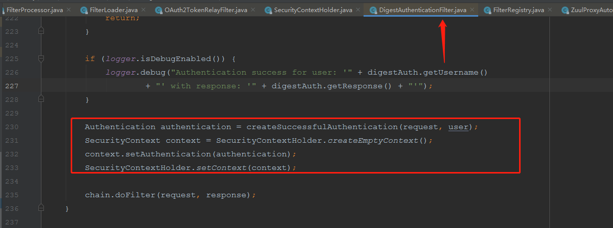

使用code 和 state 获取access_token的过程： 参考 spring-security-oauth2:2.2.1-REALEASE

在OAuth2RestTemplate.java  --- >  acquireAccessToken 方法 -->  

> ```
> accessToken = accessTokenProvider.obtainAccessToken(resource, accessTokenRequest);
> ```

AccessTokenProvider.java 接口，最后调用实现子类： AuthorizationCodeAccessTokenProvider   --->   L197 

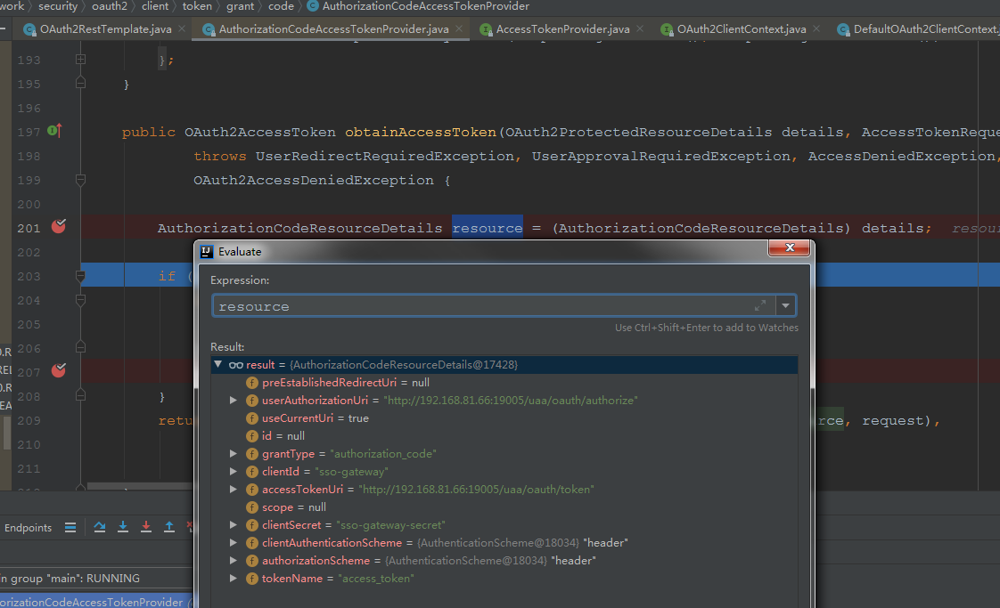

OAuth2AccessTokenSupport.java   -- 请求获取access_token

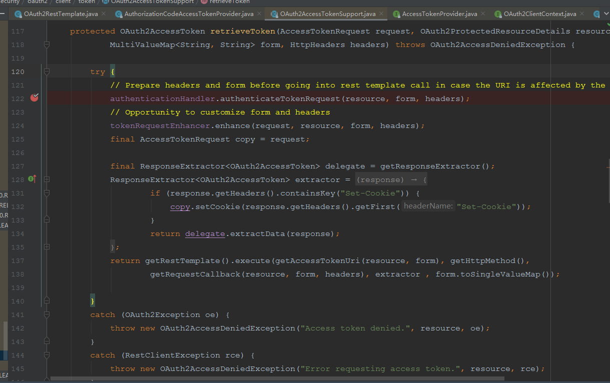

上图中的124行enhance 方法 会在请求头中加入客户端token信息

DefaultClientAuthenticationHandler.java  -->  authenticateTokenRequest 方法  将client_id+client_sercret 拼装并Base64转换

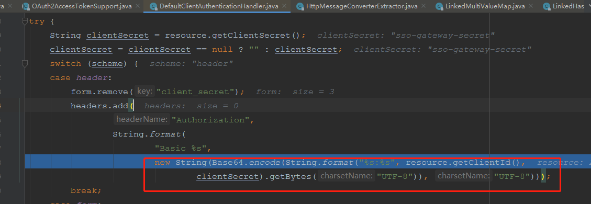

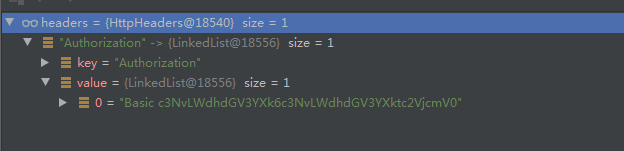


在oauth服务，是TokenEndpoint.java 类下面的postAccessToken 方法处理

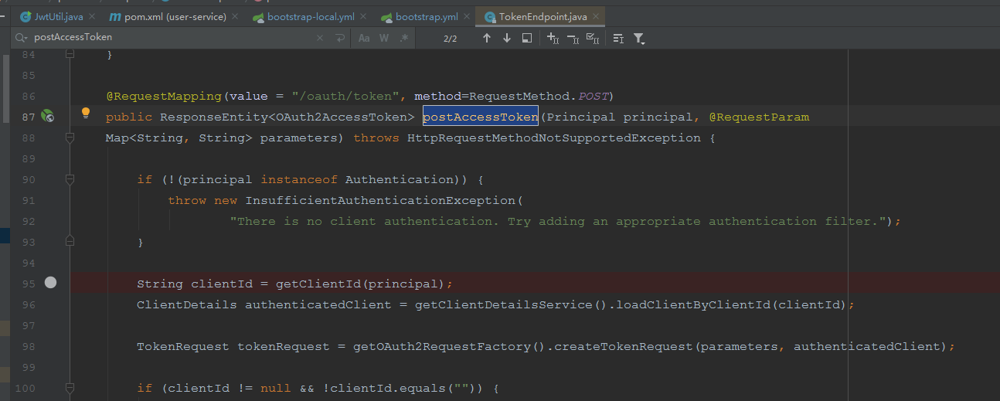

```java
org.springframework.security.oauth2.provider.endpoint.FrameworkEndpointHandlerMapping - Returning handler method [public org.springframework.http.ResponseEntity<org.springframework.security.oauth2.common.OAuth2AccessToken> org.springframework.security.oauth2.provider.endpoint.TokenEndpoint.postAccessToken(java.security.Principal,java.util.Map<java.lang.String, java.lang.String>) throws org.springframework.web.HttpRequestMethodNotSupportedException]
```


---


HttpServletRequestImpl   属于undertow-servlet:1.4.26.jar包  changeSessionId()方法， 会把originalServletContext里面的旧sessionId，替换为新的sessionId

OAuth2ClientAuthenticationProcessingFilter extends AbstractAuthenticationProcessingFilter

AuthenticationHeaderFilter.java  -- 过滤器链排序第9，设置请求头代理忽略 authorization

OAuth2AuthenticationDetails.java -- 过滤链排序第10  从httq request里面获取token，创建了OAuth2AuthenticationDetails 对象

OAuth2TokenRelayFilter  -- 往请求头里面加入token


登陆成功后，临时回话的sessionId会被登陆成功后的sessionId替换


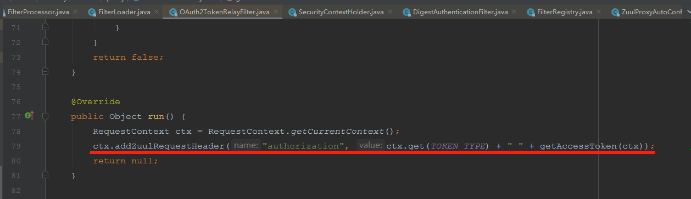


---

@PreAuthorize("hasAuthority('platform_app_addApp')")

看hasAuthority 

由SecurityExpressRoot类支持

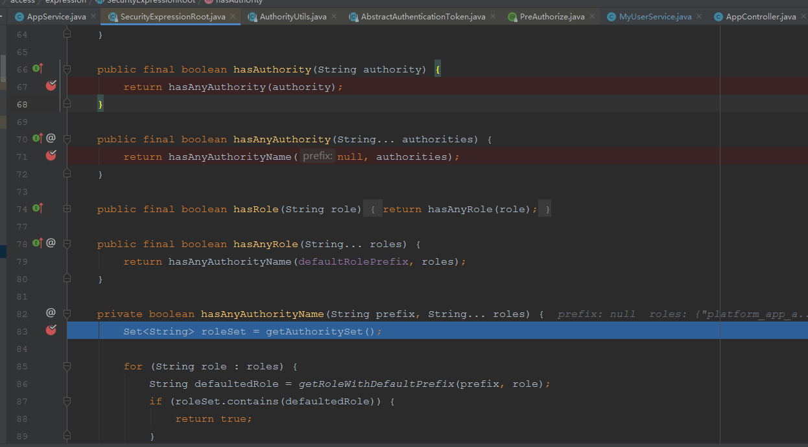

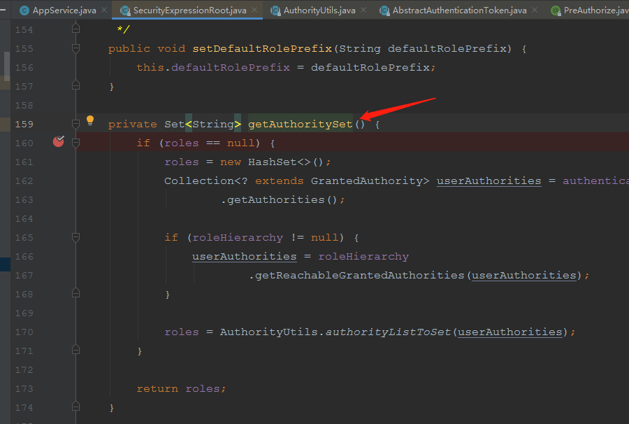


思路：重写SecurityExpressionHandler 处理器

> 参考：http://hk.uwenku.com/question/p-vlsynoyb-bnh.html

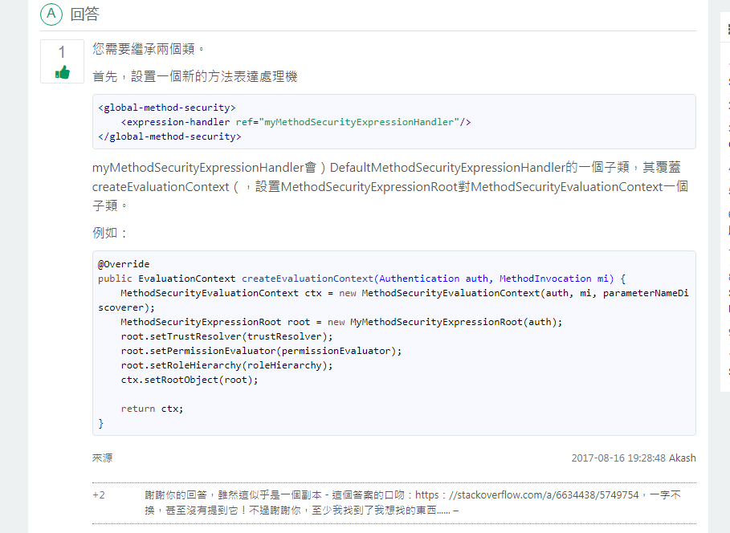

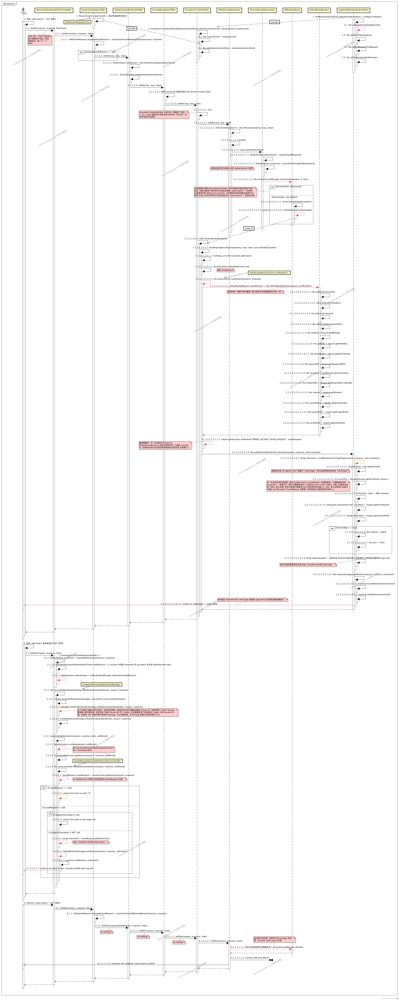