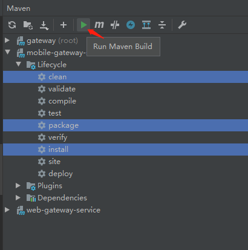
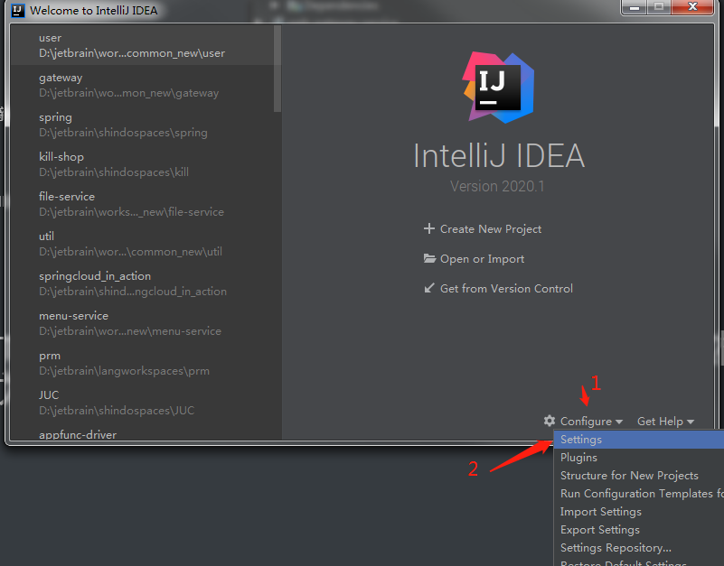
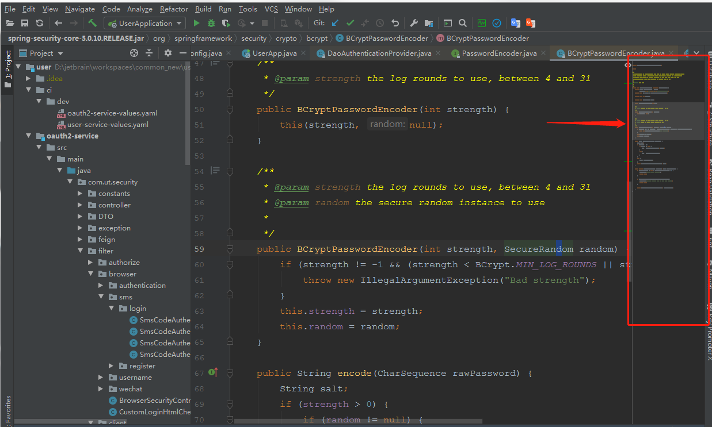

#### 如何调用maven窗口

View --> Tool Windows --> Maven即可

#### 在maven窗口一次性执行多个命令

只需把需要执行的命令使用ctrl 一起选中，就可以一起执行。

#### 新建项目的时候，修改项目变量

在IDEA启动界面右下角，选中Configure--> Settings 

### CodeGlance插件

类似SublimeText的Mini Map插件，看下图就知道什么用了

