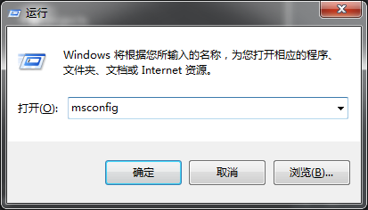
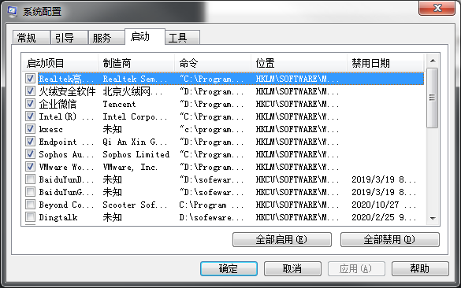
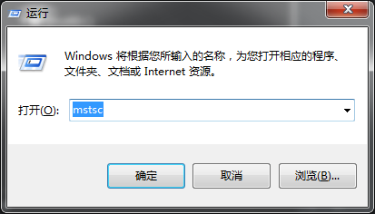
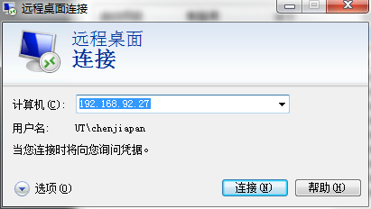
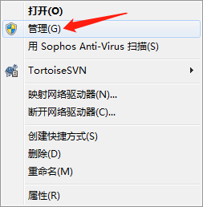
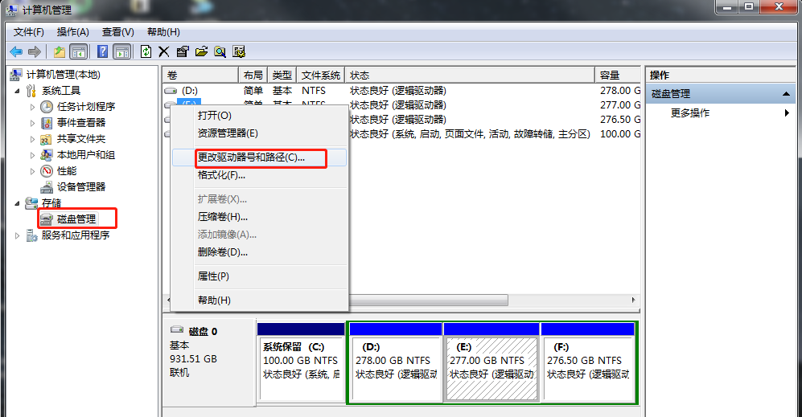
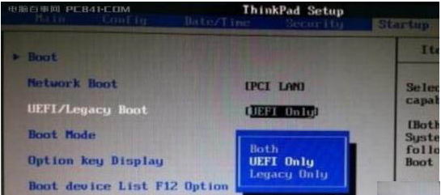
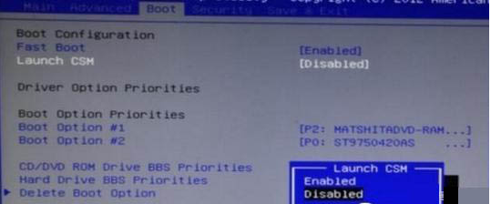

### 1、修改开机启动项

命令行输入：msconfig

### 2、远程桌面

命令行输入：mstsc

### 3、修改盘符

右击我的电脑-管理-磁盘管理-右击磁盘-更改驱动器名和路径

### 4、UEFI + GPT 和 BIOS + MBR 的区别

UEFI + GPT 是最新的系统启动方式，也是大势所趋，UEFI 启动引导界面图形化，区别鱼传统的蓝白界面，而且UEFI界面支持鼠标操作，而且GPT与MBR的最大区别是GPT支持大于2.2T的硬盘，MBR不行。

BIOS + MBR 是传统的系统启动方式，现在也叫做Legacy（遗产） 

UEFI 相比BIOS 启动会快一点，减少了自检流程。

在UFFI模式下切换到Legacy模式时，最好要把CMS选项开启，这个选项是兼容模块

> https://www.zhihu.com/question/28471913

