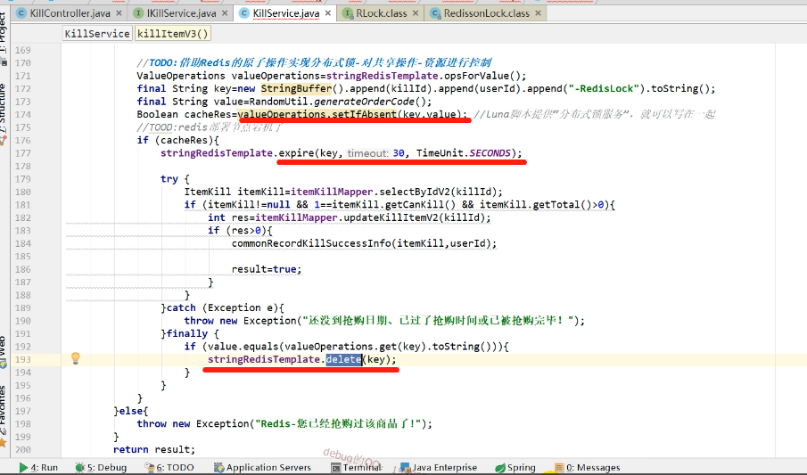

单体服务应对并发问题常用解决方案，使用synchronized 或者ReentranLock。

但是在微服务体系下就不适用了，所以需要采用分布式锁方案。

场景一：抢购商品数量  大于  用户数  （使用方案一压测暂时没问题）

场景二：抢购商品数量  小于  用户数

### 方案一：基于setNx +expire 实现

setNx：设置一个值，如果库里没有，则设置成功，如果库里已经存在相同的key，则设置失败。在finally的语句块，记得逻辑处理完后要释放锁。

expire：在业务完成后，把key释放。这是保障锁无法释放的保险机制，这个过期时间的大小需要压测评估业务的具体时间。但是不管设置多长时间，都有可能出现死锁的问题。

死锁的场景：当一个现成在使用valueOperations.setIfAbsent(key,value)设置了之后，所在节点宕机了，那么expire 和 delete操作将不会被执行，那么这个在第一步设置的key就一直缓存在redis中，重启之后，其他线程也会一直设置不成功（抢不到锁）。这就是死锁了。

### 方案二：基于redisSession实现

