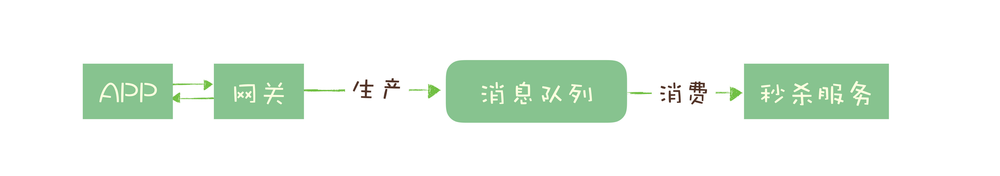

### 为什么需要消息队列

消息队列的主要功能就是收发消息，但是它的作用不仅仅只是解决应用之间的通信问题这么简单。

#### 消息队列的作用

##### 例子：巧克力工厂 

传送带解决了半成品运输问题，仓库可以暂存一些半成品，解决了上下游生产速度不一致的问题.

#### 哪些问题适合使用消息队列来解决

##### 1.异步处理

###### 例子：秒杀系统

秒杀系统需要解决的核心问题是，如何利用有限的服务器资源，尽可能多地处理短时间内的海量请求。

处理一个秒杀请求包含了很多步骤，例如：

* 风险控制；
* 库存锁定；
* 生成订单；
* 短信通知；
* 更新统计数据。

正常没有任何优化，App将请求发送给网关，依次调用上述5个流程，然后将结果返回给App。

实际秒杀是否成功，取关键作用只有风险控制和库存锁定这2步。

故可以使用消息队列优化为以下模型：

这样，一个秒杀从5步减为2步，不仅处理响应速度更快，而且秒杀期间可以调配大量资源处理秒杀，秒杀完再把资源用于后面的步骤。充分利用有限的服务器资源。

**异步处理的好处：**

* 可以更快的返回结果；
* 减少等待，自然实现了步骤之间的并发，提升系统总体的性能。

##### 2.流量控制

秒杀系统的另一个问题：如何避免过多的请求压垮我们的秒杀系统

**设计思路：使用消息队列隔离网关和后端服务，以达到流量控制和保护后端服务的目的**

模型进一步优化为：

优点：

1. 大量秒杀到达网关后，不会直接冲击后端秒杀服务，而是先堆积在消息队列，后端服务按自己最大处理能力从消费队列里的请求
2. 对于超时的请求直接丢弃，App将超时无响应请求处理为秒杀失败。
3. 运维可随时增加秒杀服务的实例数量进行水平扩容
**4. 能根据下游的处理能力自动调节流量，达到”削峰填谷“的作用。**

缺点：

1. 增加系统条用链，导致总体响应时间延长
2. 上下游系统都要将同步改为异步消息，增加系统复杂度。

###### 令牌桶限流

原理：单位时间内只发放固定数量的令牌到令牌桶中，满了就丢弃，且规定服务在处理请求之前必须先从令牌桶拿到一个令牌，如果令牌桶中没有令牌，则拒绝请求。另外系统启动的时候，可以提前生产一批令牌，可一定程度上抵挡秒杀的瞬时流量峰值。（是漏桶算法的优化  [参考限流常用算法对比](https://blog.csdn.net/forezp/article/details/85081162)）

进一步优化后的模型：

优点：这个模型，不需要破坏原有的调用链，只要在网关处理app请求是增加一个获取令牌的逻辑即可。

> spring cloud gateway 已经默认使用redis+lua脚本支持了令牌桶算法，可参考：https://blog.csdn.net/weixin_38003389/article/details/88999062

##### 3.服务解耦

消息队列的另外一个作用，就是实现系统应用之间的解耦。

例子：订单是电商系统比较核心的数据，当一个新订单创建时：

1. 支付系统需要发起支付流程；
2. 风控系统需要审核订单的合法性；
3. 客服系统需要给用户发短信告知用户；
4. 经营分析系统需要更新统计数据；
5. ……

这些下游服务都需要是谁获取订单数据。随时业务发展，下游系统不断增加、变化，且每个系统都可能只需要订单数据的一个子集。这样会导致任何一个下游系统的接口变更，都需要订单模块重新上线部署。对于一个电商的核心服务来说，这几乎无法接受。

解决方案：

引入消息队列，订单服务在订单变化时发送一条消息到消息队列的一个主题Order中，所有下游系统都订阅主题Order，这样每个下游系统都可以获得一份实时完整的订单数据。

无论增加、减少下游系统或是下游系统需求如何变化，订单服务都无需做任何更改，实现了订单服务与下游服务的解耦。

##### 其他场景

* 作为发布 / 订阅系统实现一个微服务级系统间的观察者模式；
* 连接流计算任务和数据；
* 用于将消息广播给大量接收者。

##### 局限性

* 引入消息队列带来的延迟问题；
* 增加了系统的复杂度；
* 可能产生数据不一致的问题。