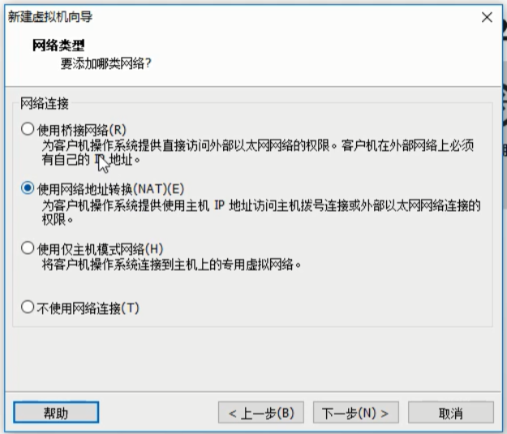

### 安装centOS 7

 

---

#### 安装centOS 6.5操作系统

双击CD/DVD，选择系统镜像

开启虚拟机

skip跳过

选择，yes,discard any data

给系统起名字

密码太简单，给出警告，这里选择忽略：Use Anyway

创建分区，选择：create custom layout

原来是设置了100g,这里不是大数据，缩小到20G

下面主要分三个区：

（第一块磁盘叫sda，如果有第二/第三块磁盘，就叫sdb,sdc，如此类推 ）

创建第一个分区：引导程序区 boot

点create

再点create

挂载到/boot

下面点create-create创建第二个分区：交换分区

内存大小设为：2048，一般是虚拟机内存的两倍（这里因为虚拟机内存是1G）

创建第三个分区：用户分区

主要要选择：Fill to maximum allowable size，就是把磁盘剩余的空间都给到用户分区(/)

分区创建完，点Next

format格式化磁盘

提示：是否把分区的变化写入磁盘，直接选：Write changes to disk

安装引导程序，直至安装完成，系统即安装完成。

---

### 配置虚拟机的网络服务

其实就是配置虚拟机网络，让其能够连接外网。原理和windows相仿。

大致步骤：

1、找到网卡位置：cd /etc/sysconfig/network-scripts/

ls查看：

ifcfg-eth0，表示第0块网卡  if代表interface，cfg代表config，eth 代表ethirnet,以太网，0代表第0块网卡

编辑网卡中的协议：vi ifcfg-eth0

HWADDR，网卡物理地址，因为要克隆，可以干掉（包括UUID）

ONBOOT=yes，代表是否启用这块网卡

MM_CONTROLLED=yes，

BOOTPROTO=dhcp，代表动态获取ip地址的方式，改为static ，手动获取ip的意思

配置ip（保证=号前后没有空格）：

IPADDR=

怎么知道要写什么ip，方式：

更改设置

搭建虚拟机的时候，已经提前设置好net模式

子网IP范围：1-254

255已经被用作广播号

NAT设置，发现.2已经被当作网关了

还有一个要注意的地方，：将主机虚拟适配器连接到此网络，是对应window系统下的虚拟网卡，用1的地址

