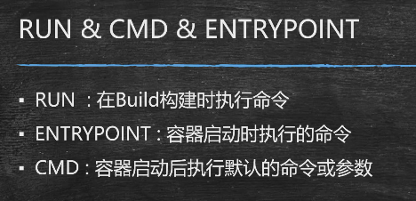
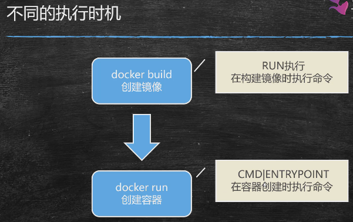
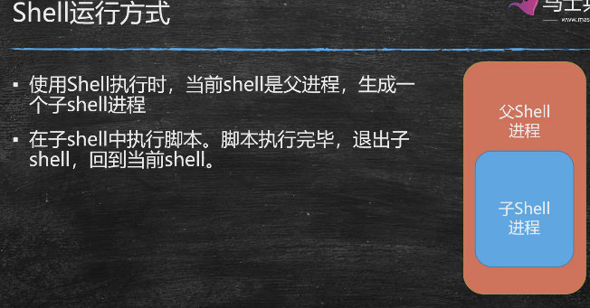
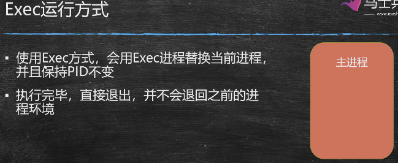
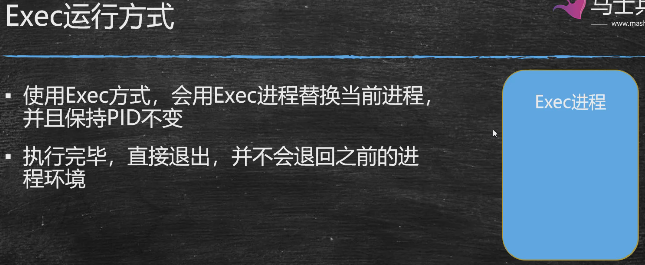
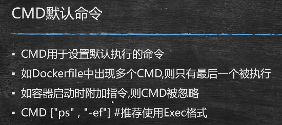

三个执行命令的区别：

run：镜像创建时，修改镜像内部的文件

cmd\entrypoint：创建容器时， 对容器内执行命令。

---

书写语法：

根本区别：是否创建子进程

结论：在大多数情况下，从综合应用的角度考虑，推荐使用Exec的方式运行指令。

Dockerfile中如果书写了多行Entrypoint命令，只有最后一行会被执行。

entrypoint一定会被运行，而cmd不一定会被运行

