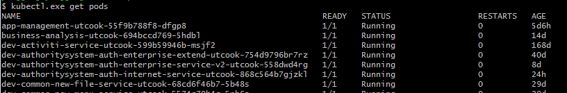
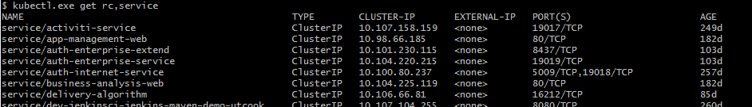
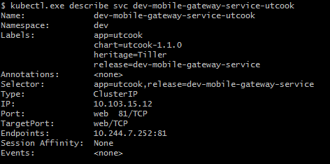
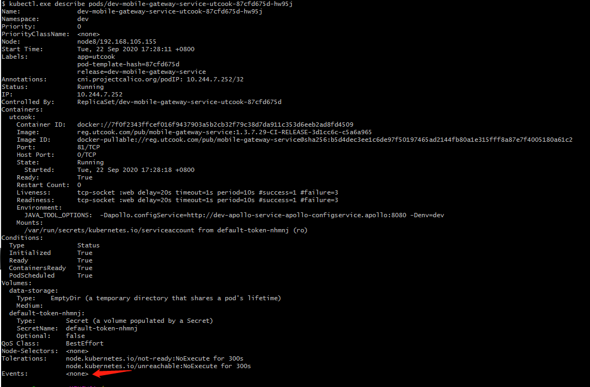

#### kubectl 常用命令

#### 1.查看资源对象

常用查看资源对象<rc> 有namespace(ns)、pods、service(svc)、endpoints(ep)、deployment(deploy)、pvc、ingress(ing)，括号内为最简写法。

```shell
# kubectl get <rc>
```

显示更多信息，在命令后面接 **-o  wide** ,  **-o  json**  或者  **-o  yaml** ， 同时查看多个资源对象用英文逗号隔开。

```shell
# kebectl get pods <pod-name> -o wide
```

查看资源对象全名（主要是前面加上资源类型），可通过kubectl  rc,<rc>  命令

对比如下：



使用rc之后：


对比svc




#### 2.创建资源对象

创建时，注意文件内是否有namespace，如果没有，请在命令后面指定 -n <namespace-name>

根据yaml配置文件一次性创建资源对象

```shell
# kubectl create -f service.yaml -f deployment.yaml
```

根据<directory>目录下所有的 .yaml、.yml、.json文件的定义进行创建操作

```shell
# kubectl create -f <directory>
```


对资源进行配置，最常用功能。

```shell
# kubectl apply -f service.yaml
或者
# kubectl apply -f <directory>
```

#### 3.编辑资源对象

编辑资源对象时，编辑器为**vi**，需要熟悉vi 命令操作

```shell
# kubectl edit deploy <deployment-name>
```

如果平常是使用yaml文件维护，注意下次修改时的配置。

#### 4.描述资源对象

显示service的详细信息

```shell
# kubectl describe svc <service-name>
```



显示pod的详细信息，其中显示的pod启动过程时间可以帮助拍错。

```shell
# kubectctl describe pods/<pod-name>
```



#### 5.删除资源对象

类似**create**命令用法

基于deployment.yaml 定义的名称删除deployment

```shell
# kubectl delete -f deployment.yaml
```

根据<directory>目录下所有 .yaml、.yml、.json文件的定义进行创建删除

```shell
# kubectl delete -f <directory>
```

删除所有包含某个label 的pod 和 service

```shell
# kubectl delete pods,svc -l name=<label-name>
```

#### 6.执行容器的命令

执行pod 的 ls 命令，默认是用pod中的第一个容器执行

```shell
# kubectl exec -it <pod-name> --ls 
```

指定pod中某个容器执行 ls  命令

```shell
# kubectl exec <pod-name> -c <container-name> ls
```

登录容器（容器中命令存在时）

```shell
# kubectl exec -it <pod-name> /bin/sh 
或者
# kubectl exec -it <pod-name> /bin/bash
```

#### 7.查看容器日志

查看容器的全部日志。pod 中有多个容器时需要指定容器名

```shell
# kubectl logs <pod-name> [container-name]
```

实时输出日志：

```shell
# kubectl logs -f <pod-name>
```

如果日志太多，可以加上 tail 参数指定查看日志的最末尾 XX 行，如下面动态跟踪查看日志最后的1000行

```shell
# kubectl logs -f --tail=1000 <pod-name>
```

也可以不动态跟踪，只查看日志的最末尾 XX 行

```shell
# kubectl logs --tail=1000 <pod-name>
```

也可以查看最近多少时间以来的日志，并实时输出，适用于日志较多，运行较久的pod，since后面的单位可变更：s-秒，m-分钟，h-小时

```shell
# kubectl logs -f <pod-name> --since 10m
```

一般配合 **describe** 命令进行拍错

```shell
# kubectl describe pods/<pod-name>
```

#### 8.pod的扩容和缩容

执行扩容缩容pod的操作，支持的资源对象有deployment、statefulset、daemonset

```shell
# kubectl scale deploy <deployment-name> --replicas=2
```

扩容与缩容是相对于当前的replicas数。如果平常是用时yaml文件维护，注意下次修改是的配置。

#### 9.pod的滚动升级

执行滚动升级操作

```shell
# kubectl rolling-update <deployment-name> -f deployment.yaml
```

也可以直接指定镜像名称的方式直接升级

```shell
# kubectl rolling-update <deployment-name> --image=example:v2.0
```

还可以使用 kubectl  edit  命令达到滚动升级目的。如果平常是使用yaml 文件维护，注意下次修改时的配置


