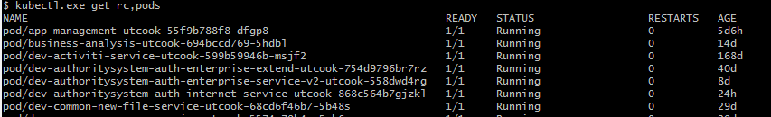

#### kubectl 常用命令

#### 1.查看资源对象

常用查看资源对象<rc> 有namespace(ns)、pods、service(svc)、endpoints(ep)、deployment(deploy)、pvc、ingress(ing)，括号内为最简写法。

```shell
# kubectl get <rc>
```

显示更多信息，在命令后面接 **-o  wide** ,  **-o  json**  或者  **-o  yaml** ， 同时查看多个资源对象用英文逗号隔开。

```shell
# kebectl get pods <pod-name> -o wide
```

查看资源对象全名（主要是前面加上资源类型），可通过kubectl  rc,<rc>  命令

对比如下：


使用rc之后：



对比svc


#### 2.创建资源对象

创建时，注意文件内是否有namespace，如果没有，请在命令后面指定 -n <namespace-name>

根据yaml配置文件一次性创建资源对象

```shell
# kubectl create -f service.yaml -f deployment.yaml
```

根据<directory>目录下所有的 .yaml、.yml、.json文件的定义进行创建操作

```shell
# kubectl create -f <directory>
```


对资源进行配置，最常用功能。

```shell
# kubectl apply -f service.yaml
或者
# kubectl apply -f <directory>
```

#### 3.编辑资源对象

编辑资源对象时，编辑器为**vi**，需要熟悉vi 命令操作

```shell
# kubectl edit deploy <deployment-name>
```

如果平常是使用yaml文件维护，注意下次修改时的配置。

#### 4.描述资源对象

显示service的详细信息

```shell
# kubectl describe svc <service-name>
```


显示pod的详细信息，其中显示的pod启动过程时间可以帮助拍错。

```shell
# kubectctl describe pods/<pod-name>
```


