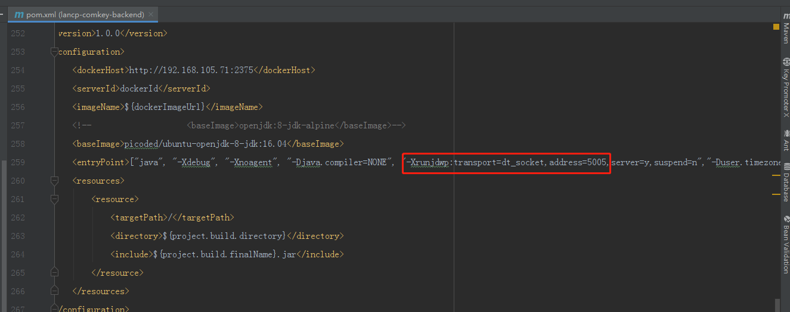

#### 容器内部暴露debug端口

设置dt_socket 属性

**<entryPoint>["java", "-Xdebug", "-Xnoagent", "-**[Djava.compiler=NONE](http://djava.compiler%3dnone/)**", "-Xrunjdwp:transport=dt_socket,address=5005,server=y,suspend=n","-Duser.timezone=GMT+08","-Djava.security.egd=file:/dev/./urandom", "-jar", "/${project.build.finalName}.jar"]</entryPoint>**