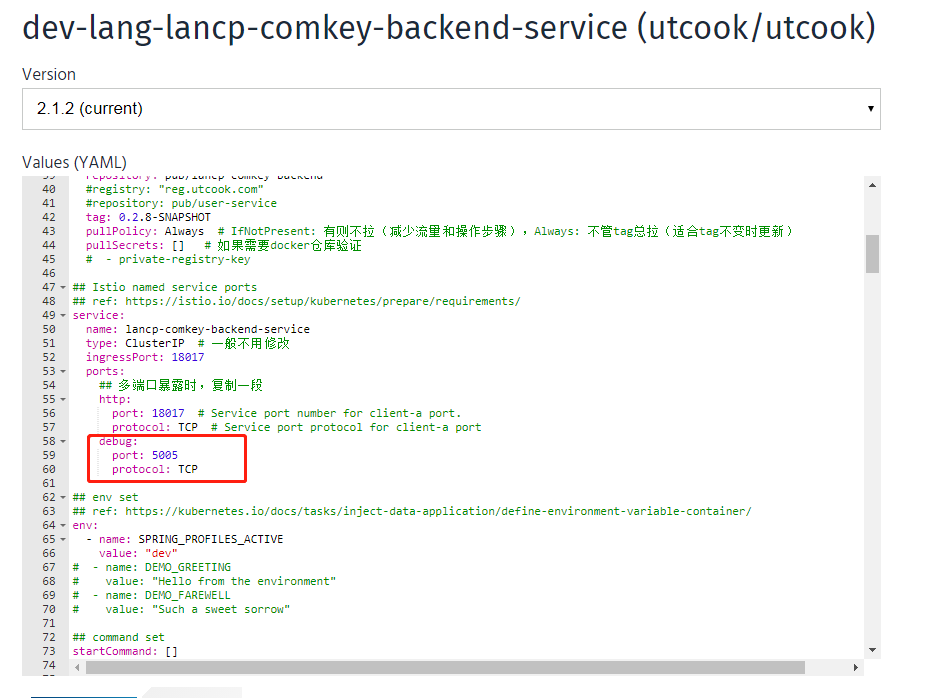
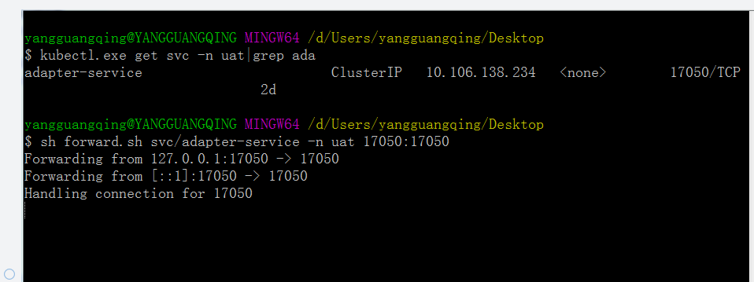
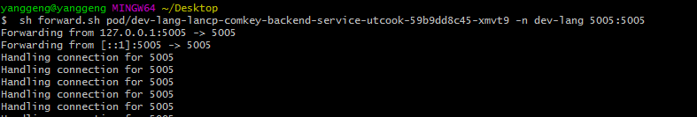
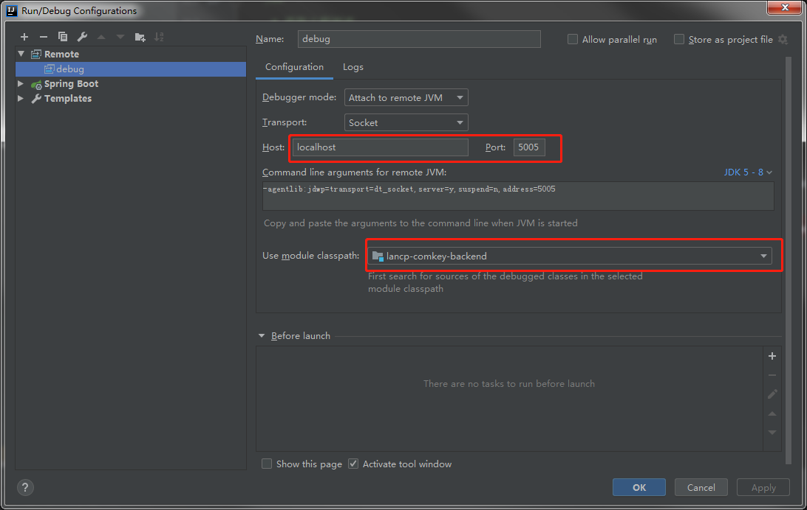
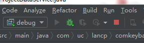
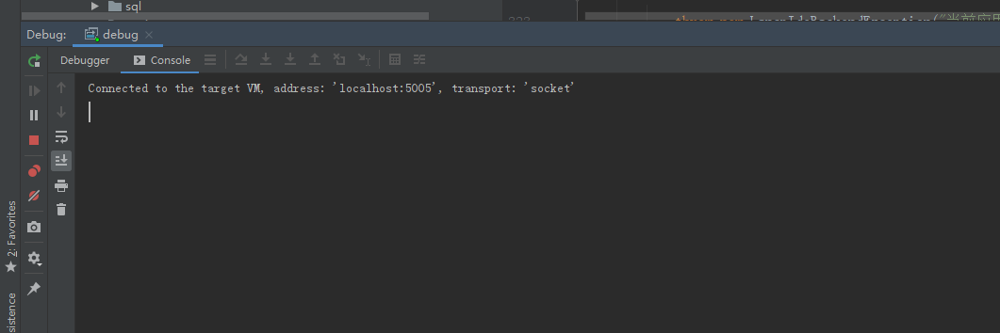
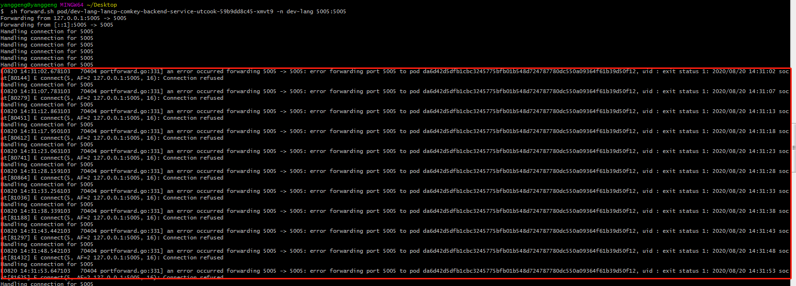

#### 容器内部暴露debug端口

设置dt_socket 属性


**<entryPoint>["java", "-Xdebug", "-Xnoagent", "-**[Djava.compiler=NONE](http://djava.compiler%3dnone/)**", "-Xrunjdwp:transport=dt_socket,address=5005,server=y,suspend=n","-Duser.timezone=GMT+08","-Djava.security.egd=file:/dev/./urandom", "-jar", "/${project.build.finalName}.jar"]</entryPoint>**

#### k8s服务部署开放debug端口




---

**具备以上条件后，才有下面的debug模式：**

#### 转发脚本 forward.sh，脚本内容如下：

```shell
# windows下请使用git bash运行
# 脚本所接参数和kubectl port-forward一样

parameters=$*
# 脚本不接参数，可自定义参数内容  
#parameters="pod/<pod_name> local_port:pod_port"


function usage(){
  echo "Usage: `basename $0` [kubectl port-forward options] "
  kubectl port-forward --help   
}

function conn() {
  while true; do
    curl -s 127.0.0.1:$1 > /dev/null
    sleep 5
  done
}

function forward() {
  kubectl port-forward $parameters --pod-running-timeout=1h &
  local_port=$(echo $parameters|awk -F: '{print $1}'|awk '{print $NF}')
  conn $local_port
}


if [ -z "$parameters" ]; then
    usage
    exit 55
fi

forward
```

在git shell 或cmd窗口 ，去到脚本所在目录，使用sh命令执行，执行转发模式由两种：service 或者pod

1. 使用service模式转发

先获取service名：



svc 转发命令：

```shell
sh  forword.sh svc/<svc_name>  -n <spacename> <本地端口>:<debug端口>
```

2. 使用 pod 模式转发：



pod 转发命令：

```shell
sh  forword.sh pod/<pod_name>  -n <spacename> <本地端口>:<debug端口>
```

#### IDEA中配置远程调用



**配置romete完成后，直接选择remote入口启动：**



**启动成功，ide控制台会输出如下信息：**



**转发脚本会输出转发日志信息：**



以上报错信息请忽略

至此，可以本地打断点调试远程服务端请求

