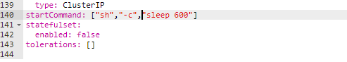

### 查看日志

kubectl.exe  logs  -f   podID      -f可以跟踪日志

kubectl.exe  logs  -f   --tail=100  podID    跟踪日志最后100行

### 查看容器详情

kubectl.exe   describe  pod   podID

### 手动起服务，看启动日志

需要修改部署模板：

在kubeapps 页面上，把startCommand 自己改为 shell, sleep 600 , 去掉健康检查。

然后在pod启动后，使用kubectl.exe   exec  -it  podID  /bin/sh   进入容器，手动启动 java程序，查看日志

["sh","-c","sleep 600"]

不行就再价格单引号