 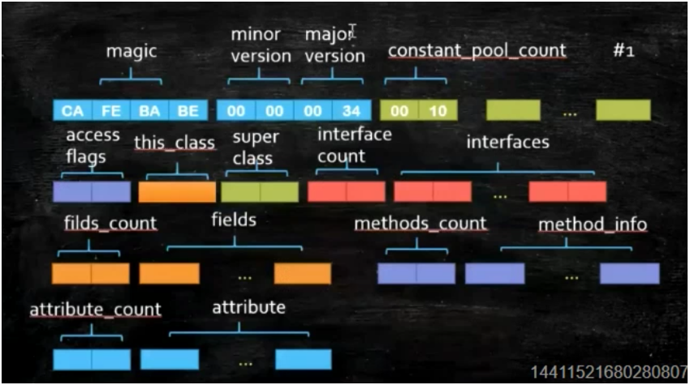

class文件怎么从硬盘上到内存，并且怎么执行的

 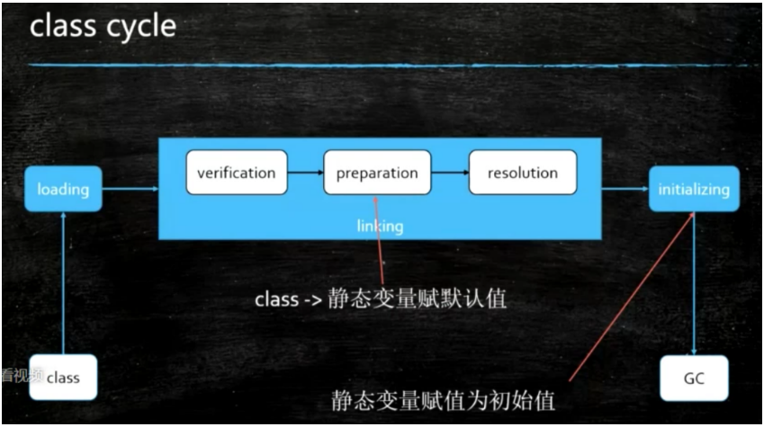

 1、加载过程
   1、loading
        双亲委派，出于安全考虑
   2、linking
      1、verification
      2、preparation
      3、resolution
   3、initializing

​    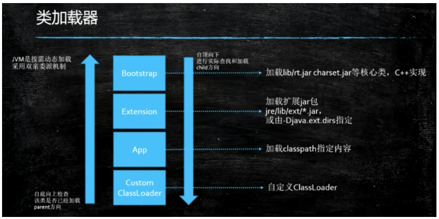

​    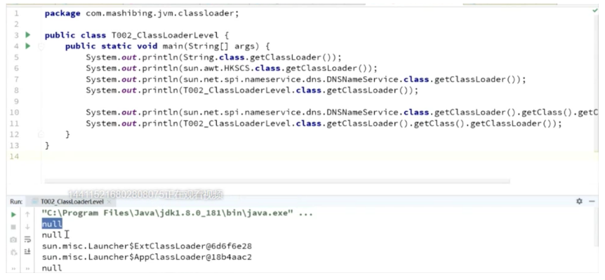

   boostarp返回null，是因为boostarp是由c++实现的，在java中并没有一个与之对应的类，所以返回null

   记住：父加载器不是继承关系

 和上图没有半毛钱关系，下图只是语法上的继承关系而已
   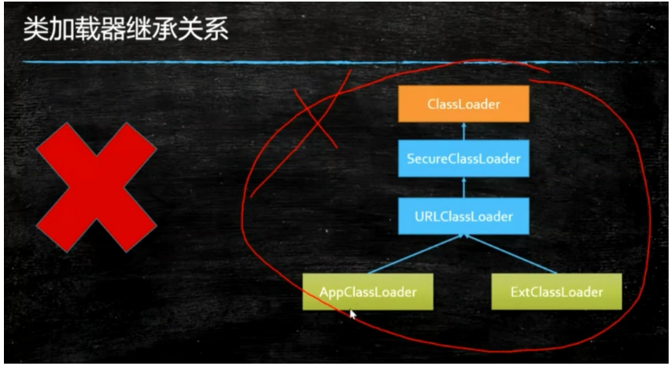

   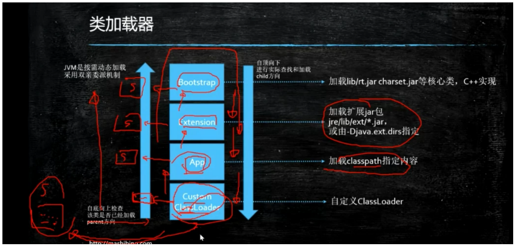

  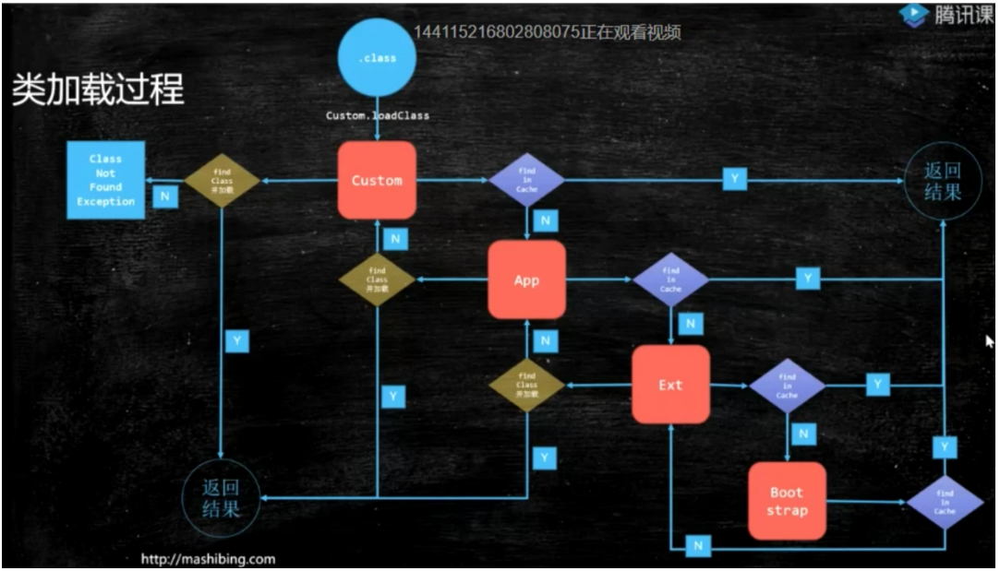

 加载不成功，抛ClassNotFoundException

 双亲委派：有一个从子到父的过程，又有一个从父到子的过程

 必问：为什么使用双亲委派机制？

 答案：主要为了安全，次要原因是已经加载的无须重复加载

  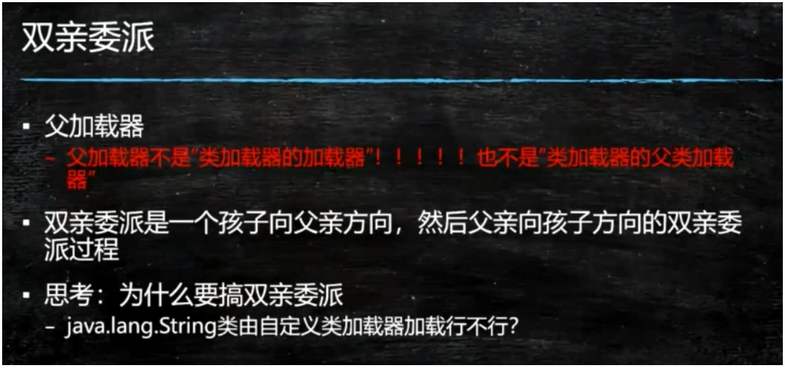

  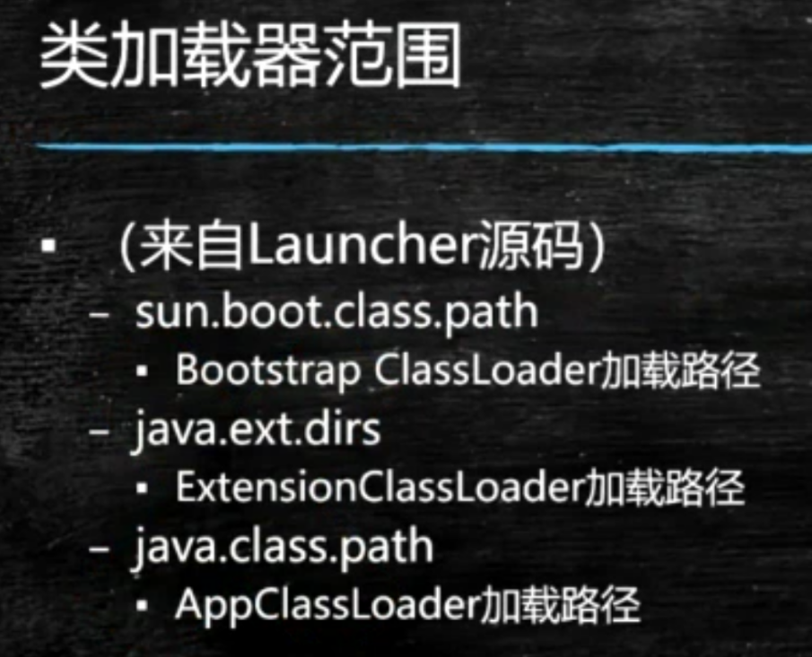

 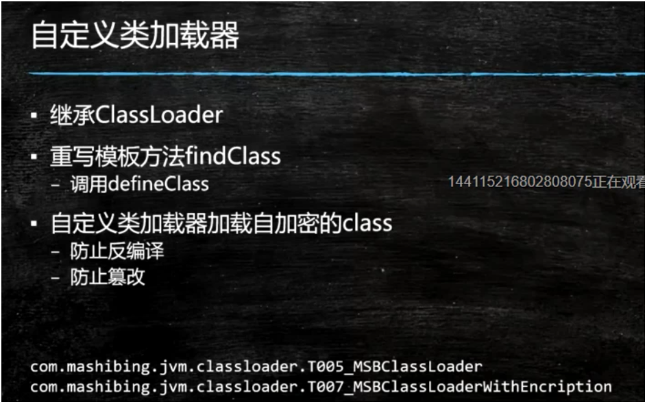

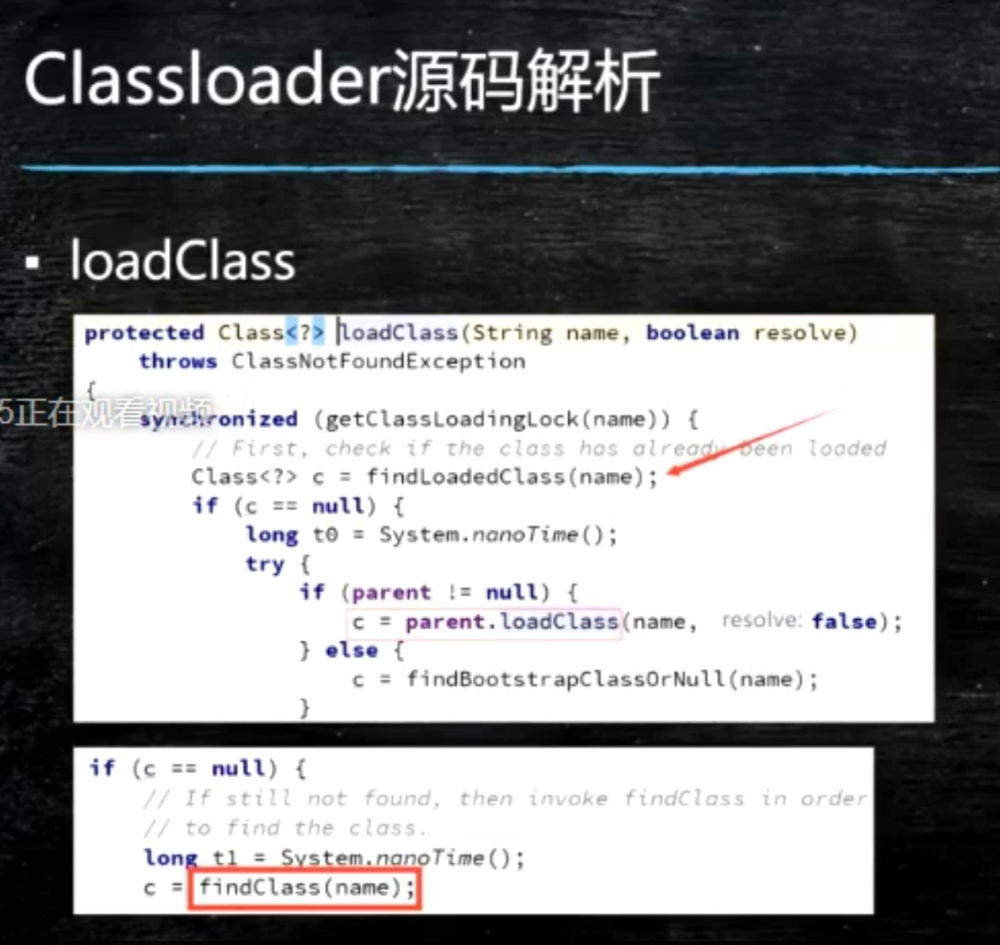

什么情况下需要自己加载类：
1、spring的动态代理
2、tomcat加载自己自定义的class
3、jrebel 热部署

 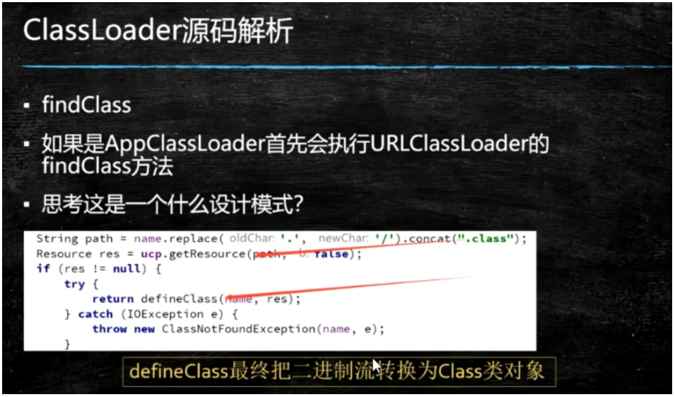
勾子函数，模板方法

 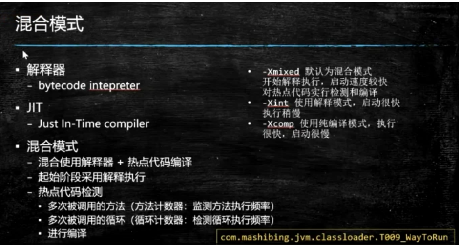

  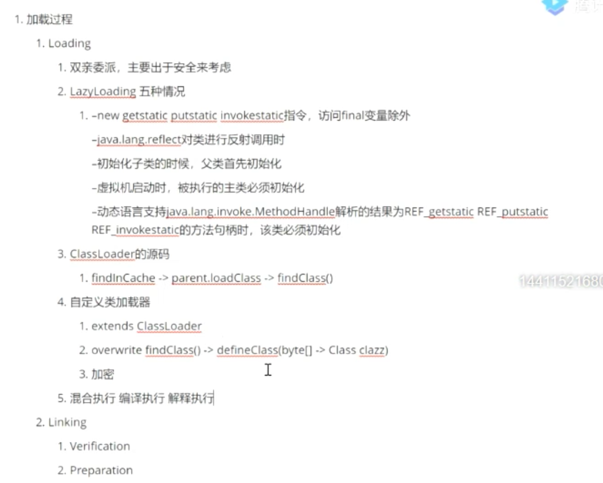

  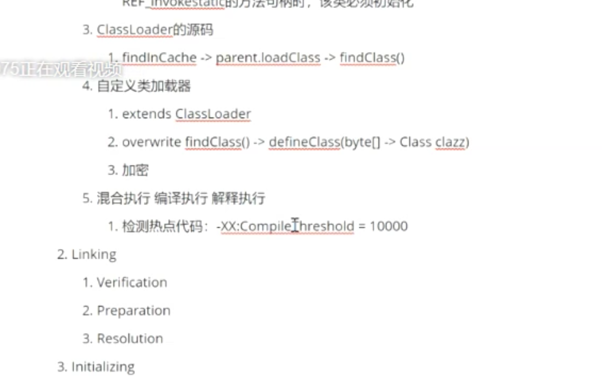