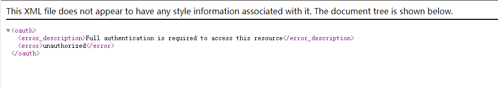
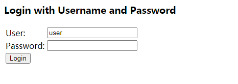
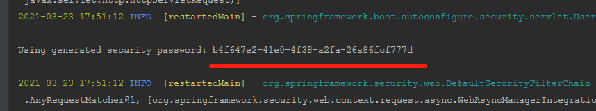
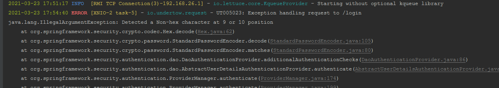
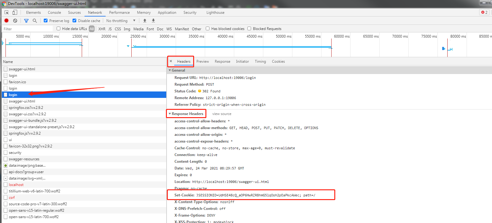
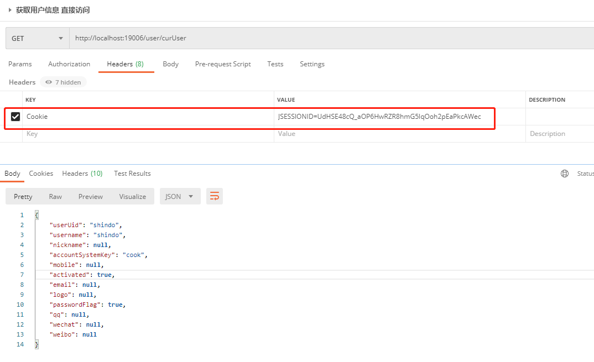
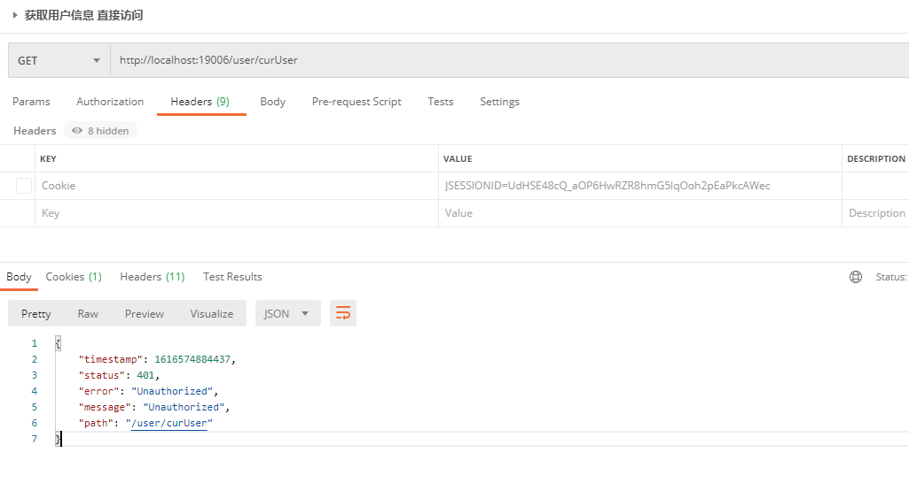

## <font style='color:red'>以下设置都是为了本地调试，提交代码时记得忽略。</font>

## 一、问题
我司服务目前采用security+oauth2 架构模型，对各微服务做资源请求安全拦截。
本地开发时，往往需要自测，但问题是，很多项目组并不具备用户中心的基础环境，无法获取合法的session，这时，往往无法直接访问自己的本地服务。

直接通过 127.0.0.1：{自身服务端口}/swagger-ui.html访问，会报以下错误：


显示，这不是你想看到的。那怎么做才能跳过oauth2的拦截呢。

## 二、解决方法
### 2.1 解除资源服务器角色
目前各个项目被定义为资源服务器的一部分，所以，任何请求都是被OAuth2AuthenticationProcessingFilter拦截。
接触方法：在自身项目的资源服务器配置里面，把@Configuration 注解注调即可。

 

### 2.2 security拦截
但是因为项目还依赖了security，所以通过上一步解除资源服务器拦截后，还会被security框架拦截。
直接访问本地服务，会弹出security默认的登录页面：
 

解决方法如下：
#### 2.2.1 输入默认密码登录
如果不指定security用户名密码，默认用户名为user，且在项目启动时，日志会打印默认的密码：
 
把对应的用户名密码输入到登录界面上即可。

但有可能你会遇到下面的情况：
输入用户名密码，页面就是登录不了，一点确认就又跳回登录页面，一看后台，报错了：
 

```java
2021-03-23 17:54:40 ERROR [XNIO-2 task-5] - io.undertow.request - UT005023: Exception handling request to /login
java.lang.IllegalArgumentException: Detected a Non-hex character at 9 or 10 position
	at org.springframework.security.crypto.codec.Hex.decode(Hex.java:62)
	at org.springframework.security.crypto.password.StandardPasswordEncoder.decode(StandardPasswordEncoder.java:105)
	at org.springframework.security.crypto.password.StandardPasswordEncoder.matches(StandardPasswordEncoder.java:80)
```
很抱歉，意味着你密码加密不对。
你可以通过下面的方式解决

#### 2.2.2 指定用户名密码登录
在yml设置security指定的登录用户名密码
```xml
spring: 
  security:
    user:
      name: shindo
	  # 下面 password 的明文是 123456
      password: 08e0457e5460de28f84df8e5bfa2ee8066409db6135fe7f695b64833a3e58473cc72e4f0bcba7306
```

这里的password很长，因为他是经过加密之后的，你可以设置你喜欢的密码通过下方的程序生成对应的密文来替换上面的值。当然，如果你也喜欢123456的密码，直接用就好。
```java
    public static void main(String[] args) {
        String SITE_WIDE_SECRET = "my-secret-salt";
        PasswordEncoder passwordEncoder= new StandardPasswordEncoder(SITE_WIDE_SECRET);
        System.out.println(passwordEncoder.encode("123456"));

    }
```

后续在登录页面，直接输入你设置的用户名密码即可顺利访问本地服务了。
 

### 2.3 postman调用

如果你的服务没有集成swagger，想通过postman工具来调试接口，可以使用如下方法：

在2.2.2步骤触发登录页时，按键盘F12，打开浏览器的开发者工具，选中Network捕获请求信息。在你输入用户名密码确认登录后，可以在login请求中找到本次登录服务器返回的session信息：
 

在postman工具中，只需求把登录响应的session设置到请求头，即可（否则会报401无权访问）：
 

不设置cookie，接口调用失败
 