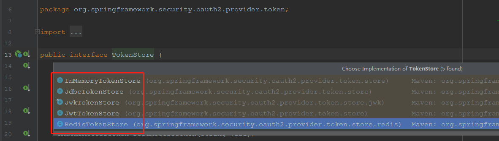
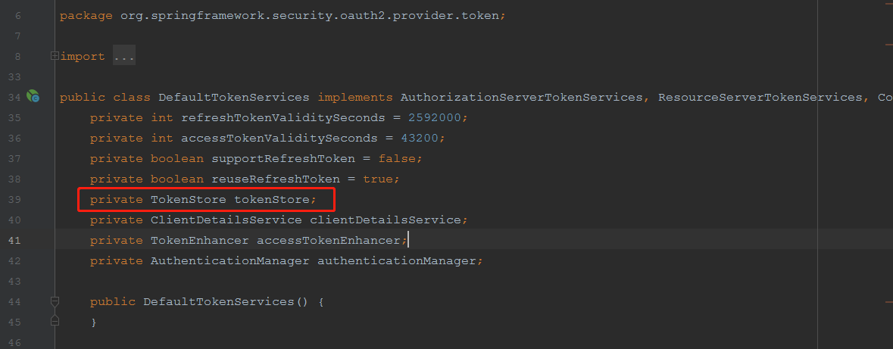
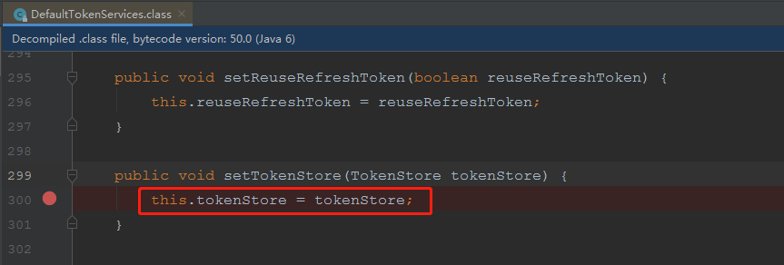

## 原jwtTokenStore方案

### 现有情况

1. oauth授权服务器采用jwtTokenStore，并配合jwtToken转换器加密的方式生成token，token在内存中保存；

2. sso单点登陆网关和资源服务器（各应用端）基于jwtToken转换器解析会话中携带的jwtToken。

### 现有问题

1. 原jwtToken转换器使用对称加密算法对token签名，签名的强度比使用RSA签名弱。
2. jwtToken的结构中保存了用户的权限信息，若用户具备大量权限的情况下，有很大概率超出web容器请求头的初始阀值，导致请求失败。

## 新RedisTokenStore方案

### 概述

security-oauth框架提供了内存、jdbc、jwt、redis四种方式（见下图）保存用户授权后的token，基于我司原采用jwt方式处理token所暴露的种种问题，从性能和针对性解决问题的角度出发，建议采取的redis的方式存储授权token。



1. oauth授权服务器采用redisTokenStore存储token，响应给用户的accessToken是redis中值对应的key。此外，总体token大小不超1k。

   ```json
   {
       "access_token": "1958d550-a724-48a5-96c1-4a5796e99d5e",
       "token_type": "bearer",
       "refresh_token": "3a5b09de-6b7b-4e2d-8950-62081021425b",
       "expires_in": 2566149,
       "scope": "read",
       "accountSystemKey": "defat",
       "username": "platform_admin"
   }
   ```

2. sso单点登陆网关和资源服务器需替换token解析方式。

   * oauth授权服务改造点

     * 新增依赖

     ```xml
     <dependency>
         <groupId>org.springframework.boot</groupId>
         <artifactId>spring-boot-starter-data-redis</artifactId>
     </dependency>
     <!--实现对 Spring Session 使用redis作为数据源的自动化配置，顺便的，只是改造redisTokenStore可以不用该依赖-->
     <dependency>
         <groupId>org.springframework.session</groupId>
         <artifactId>spring-session-data-redis</artifactId>
     </dependency>
     <dependency>
         <groupId>org.springframework.security.oauth</groupId>
         <artifactId>spring-security-oauth2</artifactId>
         <!--指明版本，解决redis存储出现的问题：java.lang.NoSuchMethodError: org.springframework.data.redis.connection.RedisConnection.set([B[B)V-->
         <version>2.3.3.RELEASE</version>
     </dependency>
     ```

     * 客户端配置补充redirectUri属性

       ```java
       /**
            * 客户端配置
            */
           @Override
           public void configure(ClientDetailsServiceConfigurer clients) throws Exception {
               clients.withClientDetails(clientDetailsService);
               clients.inMemory()
                       .withClient("sso-gateway")
                       .secret(passwordEncoder.encode("sso-gateway-secret"))
                       .authorizedGrantTypes("refresh_token", "authorization_code", "password")
                       .accessTokenValiditySeconds(60 * 60 * 24 * 30)
                       .redirectUris(ssoRedirectUri)
                       .refreshTokenValiditySeconds(2592000)//30天 单位:秒
                       .scopes("read").autoApprove(true)
                   .and()
                       .withClient("mobile-client")
                       .secret(passwordEncoder.encode("mobile-secret"))
                       .authorizedGrantTypes("refresh_token", "authorization_code", "password")
                       .accessTokenValiditySeconds(60 * 60 * 24 * 30)
                       .refreshTokenValiditySeconds(2592000)
                       .scopes("read").autoApprove(true)
                       .and()
                       .withClient("wulian-client")
                       .secret(passwordEncoder.encode("wulian-secret"))
                       .authorizedGrantTypes("refresh_token", "authorization_code", "password")
                       .accessTokenValiditySeconds(60 * 60 * 24 * 30)
                       .refreshTokenValiditySeconds(2592000)
                       .scopes("read").autoApprove(true);
           }
       ```

       

     * 改用RedisTokenStore

       ```java
           @Autowired
           RedisConnectionFactory redisConnectionFactory;   
       	
       	@Bean
           public TokenStore tokenStore() {
       //        return new JwtTokenStore(jwtAccessTokenConverter());
               return new RedisTokenStore(redisConnectionFactory);
           }
       ```

   * 需要找一个资源服务器提供priciple接口，以便于sso网关解析资源

     ```java
     @RestController
     public class UserTokenController {
     	@GetMapping("/user")
     	public Principal getCurrentUser(Principal principal) {
     		return principal;
     	}
     }
     ```

   * oauth发送token的类型要是UsernamePasswordAuthenticationToken，否则使用自定义的AuthenticationToken，资源服务在RedisTokenStore反序列化AuthenticationToken时会报找不到你之前自定义的类的异常。

   * sso网关需替换资源解析方式

   ```yaml
   security:
     basic:
       enabled: false
     oauth2:
       client:
         access-token-uri: http://${localhost_ip}:19005/uaa/oauth/token
         user-authorization-uri: http://${localhost_ip}:19005/uaa/oauth/authorize
         client-id: sso-gateway
         client-secret: sso-gateway-secret
       resource:
         #      jwt:
         #        key-value: 123
         user-info-uri: http://${localhost_ip}:19006/user
   ```

   

### 用户改造成本

**<font style='color:red'>仅需改造以下两点，切换到redisToken模式后，原业务端利用token处理的相关代码无需改动，兼容运行</font>**

1. 新增redis依赖

   ```xml
   <dependency>
   	<groupId>org.springframework.boot</groupId>
   	<artifactId>spring-boot-starter-data-redis</artifactId>
   </dependency>
   ```

   加入redis连接配置

   ```yaml
   spring:
     redis:
       host: ${localhost}
       port: 16379
       database: 2
       timeout: 10000
   ```

   

2. 客户端 资源服务器配置类（ResourceServerConfig）需替换TokenStore源

```java
//第一步：注入redis连接工厂
@Autowired
RedisConnectionFactory redisConnectionFactory;

//第二步：修改TokenStore源
@Bean
public TokenStore tokenStore() {
    return new RedisTokenStore(redisConnectionFactory); //新写法
    //        return new JwtTokenStore(jwtTokenEnhancer()); //原写法
}
```

### jwtToken和redisToken兼容性问题

oauth做为token的统一发放服务，若改动token形态，需所有客户端包括sso单点登录网关同时配合修改token新形态解析方式。

若只改动用户中心2.0环境，可从架构级别推动各项目组配合进行统一升级解析方式。但是：

#### 问题

因智厨已对接用户2.0的扫码登陆接口和部分新增的查询接口，要考虑兼容智厨的产品，那么就要求oauth在发放token时，要同时支持jwtToken和redisToken的发放，即最理想情况是：<font style='color:red'>当智厨（或者1.0的服务）请求时，响应的是jwtToken，其他情况响应redisToken。</font>

伪代码如下：

```java
//第二步：修改TokenStore源
@Bean
public TokenStore tokenStore() {
    TokenStore tokenStore = null;
    if("智厨"){
        tokenStore = new JwtTokenStore(jwtTokenEnhancer());
    }else{
        tokenStore = new RedisTokenStore(redisConnectionFactory);
    }
    return tokenStore;
}
```

但显然TokenStore对象的创建不是动态的。

#### 结论

<font style='color:red'>不支持JwtTokenStore 和 RedisTokenStore 共存。若用户中心2.0切换token形态为redisToken，需同步推动优特云内部各项目组和智厨项目组协同切换，否则接口请求报错。</font>

查看源码，可发现，TokenStore是在创建DefaultTokenService对象时设置。



