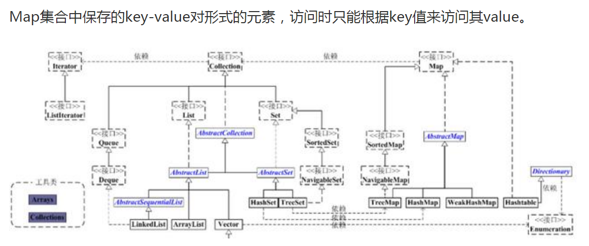
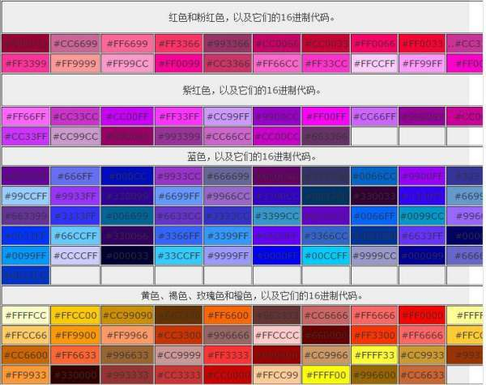

2021-01-19

- [ ] 整理面试题库

- [ ] hashmap底层原理
- [ ] juc异步转同步通讯

---

2021-01-20

- [ ] 整理老晁的笔记
- [x] 整理juc的笔记
- [ ] 网约车3期走起
- [ ] 代理模式--装饰模式
- [ ] etcd （先有个初步的概念）

---

2021-01-21

- [x] 网约车三期 01-02
- [x] 和wife商量，先不说太远，着眼当下，全力以赴
- [x] **年龄 要对上 气质** （技术自信）

---

2021-01-22

- [ ] 网约车三期 03-04
- [ ] etcd 了解p8的资料放在哪

---

2021-01-23

- [ ] 网约车三期 03-04
- [ ] 百度云盘资料整理

---

2021-01-24

- [x] ubuntu macOS美化教程
- [ ] 网约车二期在架构二班(eureka原理)
- [x] 整理面试题（同步手机）
- [x] 小怿百日（海底捞）

---

2021-01-25

- [ ] 如果真的让你搭建或维护一套架构，你handle得了吗？架构师更要求知识面

---

2021-01-26

- [ ] 网约车二期
- [ ] 整理百度云盘资料
- [ ] 周末把网约车2期全部啃完
- [ ] 气质来源于自信、经验和知识的积累（只是改变命运）
- [ ] http://www.bdata-cap.com/wzsy 看下船长的资料

关于今天看到的wps招聘，其实说到底还是因为懦弱。假如现在告诉你，有一本资料，你只要背好了，就可以进，你敢吗？甚至告诉你，你现在面就能进，你敢吗？？？

---

2021-02-27

- [ ] 和鱼蛋在来魅力喝早茶

---

2021-02-28

- [ ] 帮二家姐钻墙

---

2021-03-01

- [x] JVM超神之路.pdf

---

2021-03-02

- [ ] java集合框架
  - [ ] 参考资料：https://www.cnblogs.com/bingyang-py/p/13937976.html
  - [ ] https://juejin.cn/post/6891938021008998407
  - [ ] https://www.runoob.com/java/java-collections.html
  - [ ] http://www.360doc.com/content/18/0729/21/99071_774258376.shtml
  - [ ] Queue：
  - [ ] https://www.acfun.cn/v/ac17505616
  - [ ] https://blog.csdn.net/qq_33524158/article/details/78578370
  - [ ] https://blog.csdn.net/bieleyang/article/details/78027032
  - [ ] https://segmentfault.com/blog/ressmix_multithread?page=1
- [ ] java线程池
  - [ ] 参考资料：https://www.bilibili.com/video/av671151429/    还有百度云盘的线程池视频
  - [ ] https://ifeve.com/java%e8%b8%a9%e5%9d%91%e8%ae%b0%e7%b3%bb%e5%88%97%e4%b9%8b%e7%ba%bf%e7%a8%8b%e6%b1%a0/
  - [ ] https://www.cnblogs.com/wlandwl/p/async.html
- [ ] 用自己的话梳理出体系，找到常见的面试题
- [ ] JUC：
- [ ] https://ifeve.com/java-concurrency-thread-directory/
- [ ] https://segmentfault.com/blog/ressmix_multithread?page=1
- [ ] Spring:
- [ ] https://ifeve.com/spring-interview-questions-and-answers/
- [ ] 面试方法论：http://ifeve.com/%E3%80%8A%E6%8A%80%E6%9C%AF%E4%BA%BA%E6%B1%82%E8%81%8C%E6%8C%87%E5%8D%97%E3%80%8B%E4%B8%89-%E6%8E%8C%E6%8F%A1%E6%96%B9%E6%B3%95%E8%AE%BA/
- [ ] 设计模式：建造者，观察者，模板，动态代理 ，命令模式（hystrix，使用切面代理），职责链模式
- [ ] 

---

2021-03-03

- [ ] 这个世上还有一种东西可以让人痴迷：知识
- [ ] spring 这座高山，你什么时候才能将她征服？？？
- [ ] facebook 19890202

---

2021-03-04

- [x] docker进程1问题笔记总结
- [ ] jvm常用工具笔记总结
- [x] 问老师拿面试题
- [ ] 吃苦的定义
- [x] 网约车二期
- [ ] 你要深切明白一点：你现在做的，到底又没有让你靠近你的目标

---

什么是吃苦？

大多数人对吃苦的含义理解得太浅了。穷根本不是吃苦，穷就是穷，不是吃苦。

吃苦不是受穷的能力。吃苦的本质是长时间为了一件事聚焦的能力，以及为了长时间聚焦做一件事的过程中，所放弃的娱乐生活、所放弃的无效社交、所放弃的无意义的消费生活，以及在这个过程中所忍受的孤独和不被理解。本质是一种自控能力、自制能力和坚持能力，以及深度思考。很大程度上，靠自己成功的富人，往往比穷人能吃苦，否则他就不能靠自己白手起家。

你会发现他富了以后做事情还是比你勤奋、还是比你能忍受孤独、还是比你更有理想。

这才是吃苦。

---

2021-03-05

- [ ] oauth自定义拦截器限流

---

2021-03-08

- [ ] 你的过人之处是什么

- [ ] 为什么现在还没突围

- [ ] 银行的历史数据和最近数据怎么存储的，查的时候又是怎么查

- [ ] jvm知识点整理

  

#### 使用mongoDB重写用户中心

#### 使用gateway重写网关
#### 使用nacos优化网关
#### 阿里云安装nginx
#### 阿里云安装zipkin
#### 阿里云安装nacos
#### 阿里云安装elk

#### 基于gateway源生接口实现限流
#### 坦克项目优化
#### spring cloud 集成redis
#### mq通道集成

- [ ] spring

### 商城场景，一个订单表数据特别多？怎么优化？是历史库？但是如果有历史库，那查订单列表的时候怎么查？

线程名能确定是哪个线程池搞的事情，栈信息定位到哪个工具发起的，在什么地方阻塞了，然后用watch 看一下 那个方法的入参，查到请求地址和端口，再去找对应服务器的服务，看看是不是有问题

arthas 就直接 thread 59 这样就可以打印单个线程（threadid 59）的堆栈

